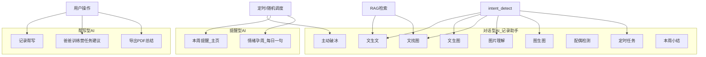
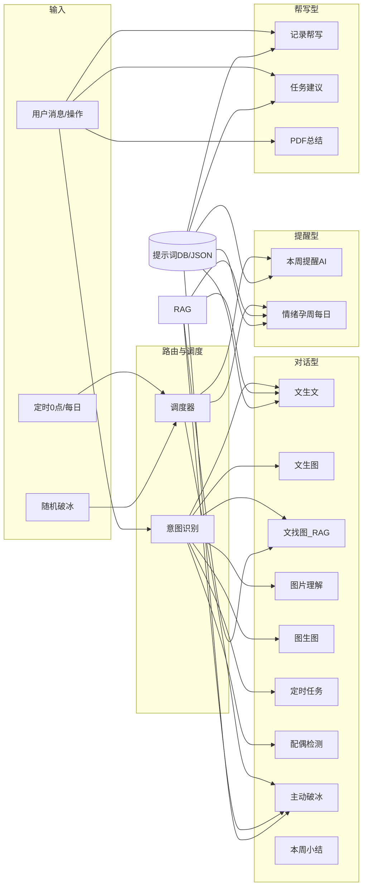

# AI 能力重组与补全计划

## 一、AI 分类与编排架构（概念层）

在现有代码基础上，用「域」来归纳现有与新增能力，便于提示词与入口管理，**不要求拆成多个 Controller**，保持 [AiController](backend/src/main/java/com/anmory/yunji/controller/AiController.java) 与 [MemoController](backend/src/main/java/com/anmory/yunji/controller/MemoController.java) 等现有入口不变。

- **对话型**：记录助手内，由意图识别分流，部分用 RAG；配偶检测、主动破冰、本周小结保持或按需增强。
- **提醒型**：由定时/调度触发，产出短文案（本周提醒 ≤20 字，情绪孕周 ≤30 字），供主页/情绪卡片展示。
- **帮写型**：由前端请求触发，统一用 [pregnancy.json](backend/src/main/resources/prompts/pregnancy.json) 的 key 管理提示词；记录帮写、任务建议、PDF 总结的提示词约束输出格式（如 Markdown、JSON）。

---

## 二、提示词管理约定

- **统一入口**：所有 AI 文案均通过 [PromptService](backend/src/main/java/com/anmory/yunji/service/PromptService.java) / [pregnancy.json](backend/src/main/resources/prompts/pregnancy.json)（或 DB 表）按 key 读取，不在业务代码里写死长串提示。
- **命名约定**（与现有 key 对齐，仅补充新 key）：
  - 对话/意图：`intent_detect`、`ai_chat_system`、`ai_chat_system_spouse` 等保持。
  - 提醒型：新增 `weekly_reminder_ai`（本周提醒，≤20 字）、`emotion_pregnancy_daily_hint`（情绪孕周每日一句，≤30 字）。
  - 破冰：新增 `proactive_icebreak_mom`、`proactive_icebreak_dad`、`proactive_icebreak_couple`（双方共收同一内容），入参含 RAG 摘要、孕周、体重等。
  - 帮写：`memo_inspire` / `memo_inspire_dad`、`memo_beautify` / `memo_beautify_dad` 明确要求「可渲染的 Markdown」；`family_task_suggest` 明确 JSON 结构便于前端 Todo 渲染。
- **不改动**：已有 `pdf_summary`、`letter_to_baby_guide`、产检/宝宝发育等 key 保持原样。

---

## 三、对话型 AI：保持与微调

- **文生文 / 文生图 / 文找图 / 图片理解 / 图生图 / 定时任务**：逻辑已存在于 AiController（意图分支、RAG、userWantsToSeePhotos、REMINDER 多轮收集）。仅需：
  - 在 **intent_detect** 中强化「文找图」：用户表达找图/搜图/查图时返回 TEXT_CHAT，且流式回复时仅在 userWantsToSeePhotos 为 true 时追加 RAG 图片（已实现），无需大改。
  - 确认 **图片理解**、**图生图** 分支不先做 RAG（当前已是先意图再分支，图理解/图生图不依赖 RAG）。
- **配偶检测**：孕妇消息含配偶 / 配偶消息含孕妇时走现有邮件与站内逻辑，保持不变；若需可增加提示词 `spouse_mention_reply` 控制回复尾句，不强制。
- **本周小结**：保持现有接口与行为不变。

---

## 四、提醒型 AI：新增与改造

### 4.1 本周提醒 AI（主页，非硬编码）

- **目标**：主页「本周提示」为 AI 生成、≤20 字，基于「上周信息」+ 当前孕周，非前端 [getStaticTip](frontend/lib/pregnancy.ts) 硬编码。
- **实现要点**：
  - **后端**：新增或扩展现有「本周提示」接口（如沿用 `/api/ai/weeklyTip` 或新 `/api/ai/weeklyReminder`）：
    - 入参：userId（或 week + 上周摘要）。
    - 上周信息：可从「上周记录条数、上周体重/心情简要」聚合（调用现有 memo/dailyLog 或 EmotionPregnancy 周汇总），拼成 1～2 句摘要。
    - 提示词 key：`weekly_reminder_ai`，约束输出「严格不多于 20 字、一句、无换行无序号」。
  - **前端**：[PregnancyCard](frontend/components/home/pregnancy-card.tsx) 的「本周提示」优先调该接口；失败时回退到现有 getAiTip 或 getStaticTip。

### 4.2 情绪孕周 AI（每日一句，0 点更新，存储）

- **目标**：每天 0 点跑一次，拉取孕妇个人信息（体重等）+ RAG 检索近期记录，生成 ≤30 字的一句，存库或 Redis（过期 1 天），前端展示在情绪-孕周相关位置。
- **实现要点**：
  - **存储**：Redis key 如 `emotion_pregnancy_daily:{userId}`，value 为 30 字内文案，TTL 24h；或表 `emotion_pregnancy_daily_hint(user_id, hint_text, created_at)`，定时任务每日 0 点写新记录并删/覆盖旧记录。
  - **定时**：新增 Scheduler（如 `@Scheduled(cron = "0 0 0 * * ?")`），对每位孕妇（或仅 creator）：调用 EmotionPregnancy 相关聚合 + RAG 最近 N 条，再调用 `emotion_pregnancy_daily_hint` 提示词，写 Redis 或 DB。
  - **接口**：GET `/api/emotionPregnancy/dailyHint?userId=` 或由现有 summary 接口顺带返回 `dailyHint` 字段；前端 [EmotionPregnancyChart](frontend/components/home/emotion-pregnancy-chart.tsx) 或首页情绪区块展示该句。

---

## 五、主动破冰：增强

- **频率**：由「每天固定 cron」改为「随机：每天至多 1 次，且有可能整天不触发」。实现方式：在现有 [ProactiveIceBreakScheduler](backend/src/main/java/com/anmory/yunji/scheduler/ProactiveIceBreakScheduler.java) 内加随机判断（如 Random.nextDouble() < 0.3 才执行），或新配置项 `proactive.icebreak-probability`，默认 0.3；cron 仍为每日一次（如 9:00），当日是否真正发由概率决定。
- **内容**：
  - **单人**：拉取该用户最近记录、体重等，RAG 检索最近内容，用 `proactive_icebreak_mom` / `proactive_icebreak_dad` 生成一条消息写入会话并保存为 AI 消息。
  - **双方同内容**：若家庭存在配偶，可随机选择「仅孕妇」「仅配偶」「双方都发」；当「双方都发」时，用 `proactive_icebreak_couple` 生成一条与双方都相关的内容，写入孕妇会话一条、配偶会话一条（同一内容），并触发邮件提醒（复用现有 MailService 给两人发或仅配偶）。
- **站内提醒**：破冰消息写入后，调用 [UserNotificationService.notifySystem](backend/src/main/java/com/anmory/yunji/service/UserNotificationService.java) 通知对应用户「记录助手给你发了一条消息」。
- **红点**：
  - **会话未读**：需要「该会话是否存在用户未读的 AI 消息」语义。实现：在 conversation 表增加 `last_read_at` 或 message 表增加 `read_at`；或简化为：每个会话维护「用户最后查看该会话的时间」，若会话最后一条消息是 AI 且创建时间晚于该时间则标未读。更简实现：在 conversation 表加 `has_unread_ai` 字段，破冰或任何 AI 回复时置 1，用户拉取该会话历史或「标记已读」接口时置 0。
  - **Tab 红点**：记录助手 Tab 有红点 = 当前用户存在至少一个「有未读 AI 消息」的会话。后端：GET `/api/ai/conversation/list` 返回会话列表时，每条会话带 `hasUnreadAi`（或 `unreadAiCount`）；前端：有任一 true 则在记录助手 Tab 显示红点；进入某会话并拉取历史后调用「标记该会话已读」，红点随之更新。

---

## 六、帮写型 AI：补全与约束

### 6.1 记录帮写（灵感/润色）

- **要求**：输出为「可被前端 Markdown 渲染」的文案，非纯文本。
- **实现**：在 [memo_inspire](backend/src/main/resources/prompts/pregnancy.json) / memo_inspire_dad、memo_beautify / memo_beautify_dad 的 system_prompt 中增加一句：「输出可为 Markdown（如加粗、列表），便于前端渲染；若为纯文字也请保持段落清晰。」  
调用方 [MemoController.inspire](backend/src/main/java/com/anmory/yunji/controller/MemoController.java)、beautifyPreview 不变，仅提示词微调。

### 6.2 爸爸训练营任务建议（前端 Todo 样式 + 提示词）

- **现象**：AI 返回的 title/description 有时无法在前端渲染成「Todo 样式」或解析失败。
- **后端**：在 [family_task_suggest](backend/src/main/resources/prompts/pregnancy.json) 中强制 JSON 结构：`[{"title":"...","description":"..."}]`，且 title 简短（≤15 字），description 可选、一两句。 [FamilyTaskServiceImpl.suggestTasksForWeek](backend/src/main/java/com/anmory/yunji/service/impl/FamilyTaskServiceImpl.java) 已做 JSON 解析与 fallback，可加强：过滤掉 title 为空或过长的项，保证前端拿到即能展示为 Todo。
- **前端**：[tasks 页](frontend/app/(app)/tasks/page.tsx) 当前用 checkbox + title + description 列表展示建议；若希望「Todo 样式」，可改为每条一条带勾选样式的行（与「我的任务」列表样式一致），或加小图标/状态样式，无需改接口结构。

### 6.3 导出 PDF 总结

- 保持现有逻辑与提示词不变。

---

## 七、实现顺序建议

1. **提示词**：在 pregnancy.json 中新增 `weekly_reminder_ai`、`emotion_pregnancy_daily_hint`、`proactive_icebreak_mom`、`proactive_icebreak_dad`、`proactive_icebreak_couple`；微调 memo_inspire/memo_beautify、family_task_suggest 的约束说明。
2. **本周提醒**：后端 weeklyReminder 接口（或扩展 weeklyTip）接入上周摘要 + 新提示词；前端 PregnancyCard 使用该接口并回退。
3. **情绪孕周每日**：Redis 或表 + 0 点定时任务 + dailyHint 接口；前端情绪区块展示。
4. **破冰**：随机概率 + RAG + 双模式（单人/双方）+ 站内通知 + 邮件；提示词三选一。
5. **会话未读与红点**：conversation 表增加 has_unread_ai 或等价逻辑；列表接口返回未读标记；「标记已读」接口；前端 Tab 与会话列表红点。
6. **爸爸训练营**：提示词与解析加固；前端建议列表样式微调为更贴近 Todo（可选）。

---

## 八、关键文件索引

| 用途      | 路径                                                                                                                                                                                                                                    |
| ------- | ------------------------------------------------------------------------------------------------------------------------------------------------------------------------------------------------------------------------------------- |
| 意图与流式对话 | [AiController](backend/src/main/java/com/anmory/yunji/controller/AiController.java)                                                                                                                                                   |
| 破冰调度与实现 | [ProactiveIceBreakScheduler](backend/src/main/java/com/anmory/yunji/scheduler/ProactiveIceBreakScheduler.java), [ProactiveIceBreakServiceImpl](backend/src/main/java/com/anmory/yunji/service/impl/ProactiveIceBreakServiceImpl.java) |
| 本周提示接口  | AiController.weeklyTip                                                                                                                                                                                                                |
| 情绪孕周聚合  | [EmotionPregnancyServiceImpl](backend/src/main/java/com/anmory/yunji/service/impl/EmotionPregnancyServiceImpl.java)                                                                                                                   |
| 任务建议    | [FamilyTaskServiceImpl.suggestTasksForWeek](backend/src/main/java/com/anmory/yunji/service/impl/FamilyTaskServiceImpl.java)                                                                                                           |
| 记录帮写    | [MemoController.inspire / beautifyPreview](backend/src/main/java/com/anmory/yunji/controller/MemoController.java)                                                                                                                     |
| 会话列表    | AiController.listConversations；[Conversation](backend/src/main/java/com/anmory/yunji/entity/Conversation.java)                                                                                                                        |
| 提示词     | [pregnancy.json](backend/src/main/resources/prompts/pregnancy.json)                                                                                                                                                                   |

---

## 九、架构图（总览）

以上在不重构整体代码的前提下，建立清晰的 AI 分类与提示词管理方式，并补全你列出的未实现或需加强的功能；实现时按「提示词 → 本周提醒 → 情绪孕周每日 → 破冰与红点 → 帮写与任务」顺序推进即可。