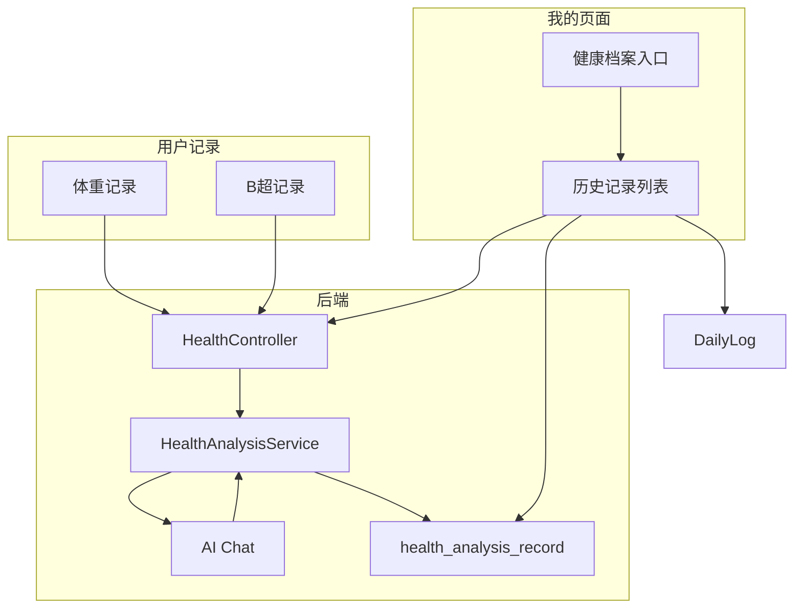

## 1. UI 风格调整：高端简约、积极向上

**目标**：减少割裂感，统一融合，去除大间隔，用浅色分割线替代。

**改动范围**：

- **[frontend/app/globals.css](frontend/app/globals.css)**  
  - 降低 `--card-border` 对比度，使分割线更柔和  
  - 弱化 `--card-shadow` 或去掉阴影  
  - 统一 `--radius-card` 为更小圆角（如 0.5rem）  
  - 新增工具类 `.card-divider`：`border-b border-[var(--card-border)]`，用于列表项间分割
- **卡片布局**：将 `gap-3`/`gap-4`/`gap-5` 改为 `gap-0`，用 `border-b` 分隔  
  - [frontend/app/(app)/health/health-home.tsx](frontend/app/(app)/health/health-home.tsx)：体重/B超入口改为单块列表，无间隙，用 `border-b` 分隔  
  - [frontend/app/(app)/health/weight/page.tsx](frontend/app/(app)/health/weight/page.tsx)、[frontend/app/(app)/health/fetal/page.tsx](frontend/app/(app)/health/fetal/page.tsx)：记录列表改为无间隙、浅色分割线  
  - [frontend/app/(app)/profile/page.tsx](frontend/app/(app)/profile/page.tsx)：统计卡片、菜单项改为单块列表，无间隙，用 `border-b` 分隔  
  - [frontend/app/(app)/community/page.tsx](frontend/app/(app)/community/page.tsx)：健康档案区域同样调整
- **配色**：整体偏暖、克制，减少高饱和色，突出「积极向上」感

---

## 2. 字体全局统一为华文中宋

- **[frontend/app/globals.css](frontend/app/globals.css)**  
  - 设置 `--font-sans` 和 `--font-serif` 为：`"华文中宋", "STZhongsong", "STSong", "SimSun", "宋体", serif`  
  - 确保 `body` 使用 `font-family: var(--font-sans)`
- **检查**：移除或覆盖其他 `font-family` 设置，保证全局一致

---

## 3. 底部导航「社区」改为「健康档案」

- **[frontend/components/bottom-nav.tsx](frontend/components/bottom-nav.tsx)**  
  - 将 `{ href: "/community", label: "社区", ... }` 改为 `label: "健康档案"`

---

## 4. AI 分析记录与保存

**流程**：孕妇记录体重或 B 超后 → 后端对比标准范围 → 调用 AI 生成建议 → 保存结果 → 前端展示并提示「可在我的 → 健康档案中查看」

**后端**：

- **新增表** `health_analysis_record`：  
`id, user_id, record_type(weight|fetal), record_id, gestation_week, analysis_text, created_at`
- **迁移**：`migration_v34_health_analysis_record.sql`
- **实体**：`HealthAnalysisRecord`  
- **Mapper**：`HealthAnalysisRecordMapper`（insert、listByUserId）
- **[HealthController](backend/src/main/java/com/anmory/yunji/controller/HealthController.java)**  
  - `addWeightRecord`：插入后调用 `HealthAnalysisService.analyzeAndSave(userId, "weight", record)`  
  - `addFetalRecord`：插入后调用 `HealthAnalysisService.analyzeAndSave(userId, "fetal", record)`
- **新增** `HealthAnalysisService`：  
  - 根据 record 和标准范围计算 status（below/within/above）  
  - 构造 prompt：用户数据、标准范围、status  
  - 调用 `ChatClient`（或 `callAiChatCompletions`）生成建议  
  - 将 `analysis_text` 写入 `health_analysis_record`
- **新增 API**：`GET /api/health/analysisHistory?userId=&limit=`：返回最近 AI 分析记录

**提示词**：  

- 体重：输入「孕周、当前体重、增重、标准范围、status」，要求「简洁、积极、可执行」的建议  
- B 超：输入「孕周、BPD/HC/AC/FL/EFW、标准范围、status」，要求「简洁、积极、可执行」的建议

**前端**：  

- 体重/B 超记录成功后：  
  - 显示「分析结果已生成，可在「我的」→「健康档案」中查看」  
  - 可选：在记录详情页内直接展示本次 AI 返回

---

## 5. 「我的」页增加健康档案与历史记录入口

**新增**：`/profile/health-history`（或 `/profile/health`）

- **菜单**：在 [frontend/app/(app)/profile/page.tsx](frontend/app/(app)/profile/page.tsx) 的 `menuItems` 中增加「健康档案」入口：`{ label: "健康档案", icon: HeartPulse, href: "/profile/health-history" }`
- **健康档案页**：  
  - 顶部：体重、B 超、心情、胎动等入口汇总  
  - 下方：  
    - **AI 分析记录**：调用 `GET /api/health/analysisHistory`，展示最近分析建议  
    - **体重记录**：调用 `GET /api/health/weightRecords`、`/api/health/fetalRecords`  
    - **心情与胎动**：调用 `GET /api/dailyLog/moodHistory?days=30`（或扩展为全量历史）
- **后端**：  
  - 新增或扩展 `GET /api/dailyLog/fullHistory`：返回 `date, mood, kickCount, weightKg, healthValue` 的完整列表（供「我的」页展示）  
  - 若无现成接口，可复用 `moodHistory` 并增加 `days` 参数（如 90）

---

## 6. 数据流示意

---

## 7. 关键文件清单

| 类型            | 文件                                                                                                              |
| ------------- | --------------------------------------------------------------------------------------------------------------- |
| 前端 UI         | `globals.css`, `health-home.tsx`, `weight/page.tsx`, `fetal/page.tsx`, `profile/page.tsx`, `community/page.tsx` |
| 底部导航          | `bottom-nav.tsx`                                                                                                |
| 新增页面          | `profile/health-history/page.tsx`                                                                               |
| 前端 API        | `lib/api/health.ts`（增加 `getAnalysisHistory`）                                                                    |
| 后端迁移          | `migration_v34_health_analysis_record.sql`                                                                      |
| 后端实体          | `HealthAnalysisRecord`                                                                                          |
| 后端 Mapper     | `HealthAnalysisRecordMapper`                                                                                    |
| 后端服务          | `HealthAnalysisService`                                                                                         |
| 后端 Controller | `HealthController`（增加 `analysisHistory`）、`DailyLogController`（可选扩展）                                             |

