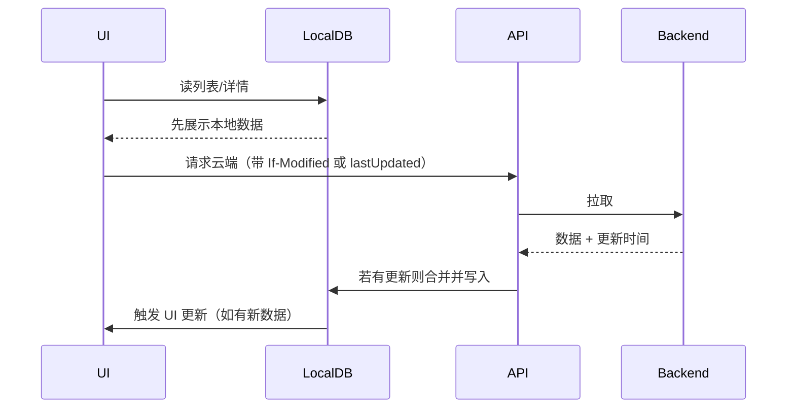

# 多图展示、缓存、本地云端与加载优化

## 1. 多图生成时展示全部上传图片（含排版）

**现状**：`ai_generation_post` 仅存单字段 `input_image_url`，发布时只存 `imageUrls.get(0)`；社区详情页只展示一张「原图」+ 一张「效果图」。

**后端**

- **库表**：新增 `input_image_urls`（TEXT/JSON），存多图 URL 数组；保留 `input_image_url` 兼容（可继续存首图或从 JSON 解析首图）。  
  - 迁移脚本：在 [backend/src/main/resources/sql/](backend/src/main/resources/sql/) 新增 `migration_vXX_input_image_urls.sql`（ALTER TABLE + 默认/兼容逻辑）。
- **实体与 Mapper**：[AiGenerationPost](backend/src/main/java/com/anmory/yunji/entity/AiGenerationPost.java) 增加 `String inputImageUrls`（JSON 字符串）；Mapper 的 INSERT/SELECT 包含新字段；列表/详情 API 已返回 post 对象，无需改路径，只需在写入时填充。
- **写入逻辑**：在 [AiController](backend/src/main/java/com/anmory/yunji/controller/AiController.java) 图生图发布分支（约 389–397 行），将 `imageUrls` 序列化为 JSON 写入 `inputImageUrls`，同时保留 `setInputImageUrl(imageUrls.get(0))` 以兼容旧客户端。

**前端**

- **类型**：[lib/api/ai-community.ts](frontend/lib/api/ai-community.ts) 的 `CommunityPostWrap.post` 增加可选字段 `inputImageUrls?: string[]`；若不存在则用 `inputImageUrl` 转成单元素数组以兼容。
- **社区作品详情**：[app/(app)/community/[postId]/page.tsx](frontend/app/(app)/community/[postId]/page.tsx) 使用 `inputImageUrls ?? (inputImageUrl ? [inputImageUrl] : [])`，多张「参考图」用网格或横向可滑动展示（如 grid 或 flex + overflow-x），每张可点击放大；效果图单独一块；保证小屏不挤、间距统一。
- **我的作品**：若列表项需要展示多张参考图，在 [app/(app)/profile/my-posts/page.tsx](frontend/app/(app)/profile/my-posts/page.tsx) 用首图或前 N 张缩略图（同上兼容逻辑），避免单卡过长。
- **对话内**：用户消息里多图已由 [chat/page.tsx](frontend/app/(app)/chat/page.tsx) 的 `imageUrls.map` 展示；若 AI 回复中需展示「本次参考了多张图」，可从消息内容或后续扩展字段解析，避免与现有 Markdown 图冲突。

---

## 2. HTTP 缓存策略

**前端（Next.js）**

- **静态资源**：在 [next.config.mjs](frontend/next.config.mjs) 的 `headers()` 中为 `/_next/static/`*、`/icon`*、`/apple-icon*` 等设置 `Cache-Control: public, max-age=31536000, immutable`（带 hash 的 chunk 可长期缓存）。
- **图片与公共资源**：若通过 Next 的 `public/` 或路由提供静态图，对相应路径设置 `max-age` + `stale-while-revalidate`（如 1 年 + 1 天）。
- **API 代理**：对 `/api-backend/`* 不做强缓存（保持 no-store 或短期 private），避免数据陈旧。

**后端（Spring Boot）**

- **静态资源**：若存在暴露 CSS/JS/图片的 Controller 或资源处理器，对静态 URL 添加 `Cache-Control: public, max-age=...`（如 1 年）和可选的 `Vary: Accept-Encoding`。
- **OSS 直链**：图片若直链阿里云 OSS，在 OSS 控制台或 CDN 配置缓存头；应用层对「代理 OSS」的接口（如有）返回 `Cache-Control` + `ETag` 更佳。

---

## 3. 本地 + 云端存储架构（记录、图生图作品、AI 对话）

**范围**：孕期记录（列表+详情）、图生图作品（我的作品列表+详情）、AI 对话列表与对话历史。写入：先写本地再异步上传云端；读取：先读本地，若云端有更新则拉取并回写本地。

**数据层**

- **本地**：使用 IndexedDB（推荐 Dexie 或 idb）建库，表/对象库建议：  
  - `records`（与 memo 列表对应，含 type/tag/createTime 等）、  
  - `record_detail`（按 id 缓存单条详情）、  
  - `ai_posts`（我的作品列表项）、  
  - `conversations`（会话列表）、  
  - `messages_{conversationId}` 或单表带 conversationId（对话历史）。  
  每条记录带 `updatedAt` 或 `version` 用于与云端比较。
- **同步标识**：云端需能返回「某用户某资源最后更新时间」或「增量变更」；若当前后端无此接口，可先实现「全量拉取后与本地 merge 再写回本地」，后续再做增量接口。

**前端流程（建议）**

- **写流程**：用户新建/编辑记录或发送消息 → 先写入 IndexedDB（标记 pending 或 localOnly）→ 调用现有后端 API 上传 → 成功后将本地记录更新为已同步并刷新 `updatedAt`；失败可保留本地并重试队列。
- **读流程**：进入记录页/作品页/对话页 → 先从 IndexedDB 取 → 渲染；同时请求云端接口；若云端返回更新（通过时间戳或全量对比），merge 后写回 IndexedDB 并更新 UI。冲突策略可先「云端优先」或「最新时间戳优先」。

**实现要点**

- 在 [lib/api/memo.ts](frontend/lib/api/memo.ts)、[lib/api/ai-community.ts](frontend/lib/api/ai-community.ts)、[lib/api/ai.ts](frontend/lib/api/ai.ts) 外再封装一层「本地优先 + 云端同步」的 facade（或在这些模块内加可选参数 useLocalFirst）；列表/详情接口各有一个「读本地」「写本地」「请求云端」「合并写回」的流程。
- 新增 `lib/sync/` 或 `lib/local-db/`：IndexedDB 初始化、表结构、读写与 merge 逻辑；可配合 React Context 提供「是否有待同步」「最后同步时间」等状态给 UI。

---

## 4. 仅加载当前页所需 JS/CSS + 图片懒加载

**JS/CSS**

- Next.js 已按路由做 code splitting；可进一步对重量级组件使用 `next/dynamic`（如 Markdown 编辑器、图表、复杂表单）并设 `loading` 占位，减少首屏 bundle。
- 样式：确保无全局一次性导入大量未用 CSS；若使用 Tailwind，已按需生成；若有按路由的 CSS 模块，保持按路由引用即可。

**图片懒加载**

- 在列表/时间轴、社区作品列表、我的作品列表、对话消息中的图片上使用原生 `loading="lazy"` 或统一封装一个 `LazyImage` 组件（Intersection Observer），在进入视口再设置 `src`（可保留低分辨率 placeholder）。
- 社区详情、记录详情、对话内首屏可见图可不懒加载；列表和长列表中的图一律懒加载。

**涉及文件**

- 记录列表卡片图：[records/page.tsx](frontend/app/(app)/records/page.tsx) 中 `record.photoUrls` 的 ``。
- 社区列表/详情、我的作品列表中的图片组件。
- 对话消息 [chat/page.tsx](frontend/app/(app)/chat/page.tsx) 中用户/助手消息里的 ``（可对非首屏消息内的图做懒加载）。

---

## 5. 异步加载脚本与样式

- 对非关键第三方脚本（如统计、反馈组件）使用 Next 的 `Script` 组件，`strategy="lazyOnload"` 或 `afterInteractive`，避免阻塞首屏。
- 在 [app/layout.tsx](frontend/app/layout.tsx) 中检查是否有同步大脚本；字体已用 `next/font` 则已优化。若有额外样式表，改为动态 import 或放在对应布局/页面内，避免根 layout 一次性拉取过多 CSS。

---

## 6. HTTP/2 与 Service Worker

- **HTTP/2**：多路复用与头部压缩由部署层（Nginx、CDN、Vercel 等）开启，应用代码无需改；在部署文档或运维说明中注明「生产环境建议开启 HTTP/2」即可。
- **Service Worker**：用于离线与静态资源缓存。
  - 使用 `next-pwa`（或 Next 14+ 的 PWA 支持）生成 SW，对 `_next/static`、`/icon`、`/manifest.json` 等做预缓存；对 API 请求可走网络优先或网络失败时回退到本地（若已与 IndexedDB 方案结合，可 SW 只缓存静态资源，数据仍由 IndexedDB + 云端逻辑处理）。
  - 在 [next.config.mjs](frontend/next.config.mjs) 中接入 `next-pwa`，在根 layout 或 `_app` 中不阻塞渲染地注册 SW；manifest 已存在 [app/layout.tsx](frontend/app/layout.tsx) 的 metadata，保持即可。

---

## 实施顺序建议

| 阶段  | 内容                                                                           |
| --- | ---------------------------------------------------------------------------- |
| 1   | 多图存储与展示：DB 迁移 + 后端写入/返回 inputImageUrls + 前端社区/我的作品展示与排版                      |
| 2   | 缓存：Next 静态头 + 后端静态资源 Cache-Control；图片懒加载 + 列表/详情处 LazyImage 或 loading="lazy" |
| 3   | 按需与异步：dynamic 重量组件 + Script 策略 + 非关键 CSS 异步                                  |
| 4   | 本地+云端：IndexedDB 表设计 → 记录/作品/对话的「读本地→请求云端→合并写回」与「写先本地再上传」                     |
| 5   | PWA/SW：next-pwa 集成与静态资源缓存；HTTP/2 文档说明                                        |

依赖关系：多图与缓存/懒加载可并行；本地云端依赖现有 API 且可能需少量后端扩展（如返回 updatedAt）；Service Worker 可最后加，与本地库无强耦合。