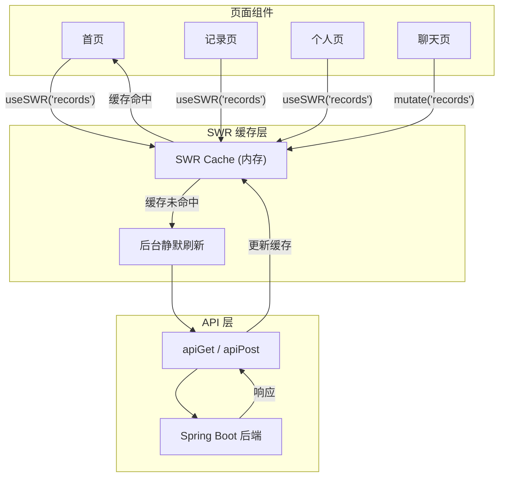

# 性能优化与导航修复方案

## 问题诊断

当前项目存在三个核心问题：

1. **无数据缓存**：每个页面 `useEffect` 中直接调 API，从二级页面返回时重新 fetch + 重新渲染，造成明显卡顿和闪烁
2. **返回按钮随缘跳转**：约 30 处使用 `router.back()`，依赖浏览器 history 栈，但 Next.js App Router 和 `chat/page.tsx` 中的 `replaceState` 会污染 history，导致返回行为不可预测
3. **无骨架屏/加载占位**：大部分组件 loading 时 `return null`，数据到达后突然撑开，布局跳动

---

## 方案一：引入 SWR 实现全局缓存层

### 1.1 安装 SWR

在 [frontend/package.json](frontend/package.json) 中添加 `swr` 依赖。SWR（Stale-While-Revalidate）是轻量级数据请求库，核心能力：

- **staleTime**：缓存有效期内直接返回缓存数据，不发请求
- **revalidateOnFocus**：页面重新获得焦点时静默刷新（用户无感）
- **deduplication**：同一 key 的并发请求自动去重
- **缓存跨页面共享**：导航回到首页时直接展示上次缓存的数据，后台静默更新

### 1.2 创建全局 SWR 配置

在 [frontend/lib/swr-config.tsx](frontend/lib/swr-config.tsx) 中创建 `SWRProvider`：

```tsx
import { SWRConfig } from "swr"
export function SWRProvider({ children }) {
  return (
    <SWRConfig value={{
      revalidateOnFocus: true,       // 页面重获焦点时静默刷新
      revalidateOnReconnect: true,   // 网络恢复时刷新
      dedupingInterval: 5000,        // 5秒内相同请求去重
      errorRetryCount: 2,            // 错误最多重试2次
      keepPreviousData: true,        // 切换key时保留旧数据（避免闪白）
    }}>
      {children}
    </SWRConfig>
  )
}
```

在 [frontend/app/(app)/layout.tsx](frontend/app/(app)/layout.tsx) 的 `AuthProvider` 内包裹 `SWRProvider`。

### 1.3 创建通用 hook

在 [frontend/lib/hooks/](frontend/lib/hooks/) 下按模块创建 SWR hooks，例如：

- `use-records.ts` — 封装 `getAllEnriched`/`getFamilyEnriched`
- `use-family.ts` — 封装 `getMyFamily`/`getFamilyMembers`
- `use-health.ts` — 封装体重/B超记录
- `use-goals.ts` — 封装目标数据
- `use-notifications.ts` — 封装未读通知

每个 hook 示例：

```tsx
export function useRecords(userId: number | undefined, userType: string | undefined) {
  const fetcher = () =>
    userType === "family_member"
      ? getFamilyEnriched(userId!)
      : getAllEnriched(userId!)
  return useSWR(
    userId ? ["records", userId, userType] : null,
    fetcher,
  )
}
```

### 1.4 改造各页面

将各页面中的 `useEffect` + `useState` 数据拉取替换为 SWR hook 调用。核心改造页面：


| 页面                 | 当前方式                            | 改造后                                              |
| ------------------ | ------------------------------- | ------------------------------------------------ |
| 首页 `page.tsx`      | useEffect + getAllEnriched      | `useRecords(userId, userType)`                   |
| records/page.tsx   | useEffect + fetchRecords        | `useRecords` + `useFamily`                       |
| profile/page.tsx   | 3个useEffect                     | `useRecords` + `usePregnancy` + `useUnreadCount` |
| chat/page.tsx      | useEffect + getConversationList | `useConversations(userId)`                       |
| goals/page.tsx     | useEffect + getGoals            | `useGoals(userId)`                               |
| community/page.tsx | useEffect                       | `useHealthRecords(userId)`                       |


**关键行为变化**：

- 首次进入页面：正常请求并缓存
- 从二级页面返回：**立即展示缓存数据**，后台静默 revalidate
- 数据有变更时（如新增记录后）：通过 `mutate()` 手动刷新特定 key
- 写操作后：调用 `mutate(["records", userId, userType])` 主动使缓存失效

### 1.5 写操作后的缓存更新策略

在数据写入成功（如新增体重记录、新增日记）后，调用 `mutate()` 使对应缓存失效，确保返回列表页时展示最新数据。

---

## 方案二：修复返回按钮"随缘跳转"

### 2.1 增强 `useBack` hook

改造 [frontend/lib/use-back.ts](frontend/lib/use-back.ts)，将裸 `router.back()` 替换为确定性导航：

```tsx
export function useBack(defaultPath: string) {
  const router = useRouter()
  return useCallback(() => {
    router.push(defaultPath)
  }, [router, defaultPath])
}
```

**核心思路**：不再依赖浏览器 history 栈（它在 SPA 中不可靠），改为显式指定返回目标。每个二级页面都知道自己的父页面是谁。

### 2.2 全量替换所有 `router.back()` 调用

将约 30 处 `router.back()` 统一替换为 `useBack(parentPath)`，按页面映射：


| 二级页面                      | 默认返回目标              |
| ------------------------- | ------------------- |
| `health/weight`           | `/community` (健康档案) |
| `health/fetal`            | `/community`        |
| `profile/settings`        | `/profile`          |
| `profile/bind-email`      | `/profile/settings` |
| `profile/change-password` | `/profile/settings` |
| `profile/contact`         | `/profile/help`     |
| `profile/guide`           | `/profile`          |
| `profile/health-history`  | `/profile`          |
| `profile/help`            | `/profile`          |
| `profile/notifications`   | `/profile`          |
| `profile/privacy`         | `/profile`          |
| `profile/rate`            | `/profile`          |
| `goals`                   | `/`                 |
| `tasks`                   | `/`                 |
| `relax`                   | `/`                 |
| `family`                  | `/profile`          |
| `family/join`             | `/family`           |
| `articles`                | `/`                 |
| `articles/[id]`           | `/articles`         |
| `notifications`           | `/`                 |
| `admin/article/new`       | `/admin`            |
| `admin/article/[id]`      | `/admin`            |


---

## 方案三：添加骨架屏/加载占位

### 3.1 创建 Next.js route-level loading.tsx

在核心路由下创建 `loading.tsx` 文件，利用 Next.js 的 Suspense 边界，在路由切换时立即展示骨架屏：

- `app/(app)/loading.tsx` — 通用全页骨架
- `app/(app)/records/loading.tsx`
- `app/(app)/chat/loading.tsx`
- `app/(app)/profile/loading.tsx`
- `app/(app)/community/loading.tsx`

每个 loading.tsx 渲染与对应页面布局一致的 Skeleton 占位，使用已有的 `components/ui/skeleton.tsx` 组件。

### 3.2 SWR 的 keepPreviousData

配合 SWR 的 `keepPreviousData: true`，在页面切换时如果有缓存数据就直接展示，只有真正首次加载才显示骨架屏。这是消除抖动的关键。

---

## 方案四：HTTP 缓存与静态资源优化

### 4.1 Next.js 配置 HTTP 缓存头

在 [frontend/next.config.mjs](frontend/next.config.mjs) 中配置 `headers()`，为静态资源设置长缓存：

```js
async headers() {
  return [
    {
      source: "/_next/static/:path*",
      headers: [
        { key: "Cache-Control", value: "public, max-age=31536000, immutable" },
      ],
    },
    {
      source: "/images/:path*",
      headers: [
        { key: "Cache-Control", value: "public, max-age=86400, stale-while-revalidate=604800" },
      ],
    },
  ]
},
```

### 4.2 图片懒加载

Next.js 的 `Image` 组件默认开启懒加载。检查项目中所有 `` 标签，替换为 `next/image` 的 `Image` 组件或添加 `loading="lazy"` 属性。

---

## 数据流架构




## 实施优先级

1. SWR 缓存层（解决核心性能问题） > 2. 返回按钮修复（解决导航问题） > 3. 骨架屏（提升感知性能） > 4. HTTP 缓存头（锦上添花）

