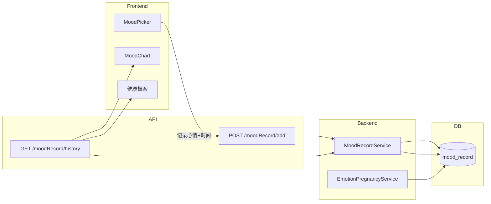

# 模态框可读性 + 页面重构 + 心情多次记录

## 一、模态框与内容区可读性修复

**根因**：`--card` 被设为 `transparent`，Dialog 和卡片内容区使用 `bg-[var(--card)]`，导致文字与背景对比不足。

**方案**：

1. **全局变量** [globals.css](frontend/app/globals.css)
  - 新增 `--card-solid: #FFFCF9`（用于需强可读性的内容）
  - 新增 `--card-readability: rgba(255, 252, 249, 0.98)`（用于 Dialog 等模态框）
  - 保留 `--card` 用于装饰性区域，但内容区域改用 `--card-solid` 或 `--card-readability`
2. **Dialog 组件** [components/ui/dialog.tsx](frontend/components/ui/dialog.tsx)
  - 默认 `DialogContent` 使用 `bg-[var(--card-readability)]` 或 `bg-background`，确保不透明、高对比度
3. **AlertDialog 组件** [components/ui/alert-dialog.tsx](frontend/components/ui/alert-dialog.tsx)
  - 同样为 `AlertDialogContent` 设置不透明背景
4. **所有使用 Dialog 的页面**（健康建议、编辑资料、日期选择等）
  - 统一使用 `className="bg-[#FFFCF9]"` 或 `bg-background`，保证文字清晰可读
5. **卡片内容区**（体重记录列表、健康档案列表、B 超、体重页等）
  - 将 `bg-[var(--card)]` 改为 `bg-[var(--card-solid)]` 或 `bg-white/95`
  - 涉及文件：[weight/page.tsx](frontend/app/(app)/health/weight/page.tsx)、[health-history/page.tsx](frontend/app/(app)/profile/health-history/page.tsx)、[fetal/page.tsx](frontend/app/(app)/health/fetal/page.tsx)

---

## 二、移除主页体重记录入口

**修改** [frontend/app/(app)/page.tsx](frontend/app/(app)/page.tsx)

- 删除 `WeightRecorder` 组件的导入与渲染
- 体重记录仍通过「健康档案」→ 体重 / B 超 进入

---

## 三、心情记录功能完善（一天多次 + 时间戳 + 可选扩展 + AI 分析）

### 3.1 数据库

新增表 `mood_record`：

```sql
CREATE TABLE mood_record (
  id INT PRIMARY KEY AUTO_INCREMENT,
  user_id INT NOT NULL,
  record_date DATE NOT NULL,
  record_time TIME NOT NULL COMMENT '记录时刻',
  mood VARCHAR(30) NOT NULL,
  created_at DATETIME DEFAULT NOW(),
  FOREIGN KEY (user_id) REFERENCES user(user_id) ON DELETE CASCADE,
  INDEX idx_user_date (user_id, record_date)
);
```

迁移文件：`backend/src/main/resources/sql/migration_v36_mood_record.sql`

### 3.2 后端

- **新增实体** `MoodRecord.java`
- **新增 Mapper** `MoodRecordMapper.java`
- **新增 Service** `MoodRecordService`：`addMoodRecord(userId, recordDate, recordTime, mood)`、`getMoodRecordsByUserAndDateRange(userId, from, to)`
- **新增 Controller** `MoodRecordController` 或扩展 `DailyLogController`：
  - `POST /api/moodRecord/add`：userId, recordDate, recordTime, mood
  - `GET /api/moodRecord/history`：userId, days
- **修改** [EmotionPregnancyServiceImpl.java](backend/src/main/java/com/anmory/yunji/service/impl/EmotionPregnancyServiceImpl.java)：从 `mood_record` 读取心情数据供 AI 分析（替代或补充 `user_daily_log.mood`）

### 3.3 前端

- **扩展心情选项** [mood-picker.tsx](frontend/components/home/mood-picker.tsx)：
  - 当前：happy, calm, tired, anxious, peaceful（5 个）
  - 扩展为：开心、平静、疲惫、焦虑、安心、兴奋、感恩、困倦、精力充沛、难过、担忧、放松、紧张、忐忑、喜悦、满足、烦躁、期待等（约 12–16 个）
- **新 API** [lib/api/daily.ts](frontend/lib/api/daily.ts) 或新建 `lib/api/mood.ts`：
  - `addMoodRecord(userId, recordDate, recordTime, mood)`
  - `getMoodRecordHistory(userId, days)` 返回 `{ date, records: [{ time, mood }] }`
- **重写 MoodPicker**：
  - 支持一天多次记录
  - 每次记录保存当前时间（含时分）
  - 展示今日已记录列表：时间 + 心情
  - 使用网格或列表展示更多心情选项
- **MoodChart** [mood-chart.tsx](frontend/components/home/mood-chart.tsx)：
  - 支持一天多次数据，按日期聚合展示
- **健康档案心情与胎动** [health-history/page.tsx](frontend/app/(app)/profile/health-history/page.tsx)：
  - 展示带时间的心情记录

---

## 四、整体页面重构（更温馨、积极、对标 iOS 26）

- **参考**：2025 孕期 App 趋势：简洁、庆祝、情感支持、温暖配色、柔和圆角、清晰层次
- **globals.css**：
  - 保留华文中宋、浅粉/薄荷绿/暖白主色
  - 内容区统一使用 `--card-solid` 或 `--card-readability`，避免透明导致文字难读
- **首页**：
  - 移除 WeightRecorder
  - 保持 Hero、Progress、小贴士、健康档案、语音气泡等结构
  - 增强对比度与留白，提升可读性
- **体重记录页** [health/weight/page.tsx](frontend/app/(app)/health/weight/page.tsx)：
  - 列表卡片使用 `bg-[var(--card-solid)]`
  - 健康建议文案使用深色文字，确保可读
- **健康档案页** [health-history/page.tsx](frontend/app/(app)/profile/health-history/page.tsx)：
  - 卡片使用不透明背景
  - 心情与胎动区支持多时段心情展示
- **Dialog / AlertDialog**：
  - 统一使用不透明背景，避免毛玻璃影响文字可读性

---

## 五、实施顺序

1. 修复模态框与可读性（globals + Dialog + 各页面卡片）
2. 移除主页体重记录入口
3. 心情多次记录：数据库 → 后端 → 前端 API → MoodPicker 重写 → MoodChart / 健康档案 适配
4. 整体视觉微调（对比度、留白、配色）

---

## 六、数据流示意（心情多次记录）




