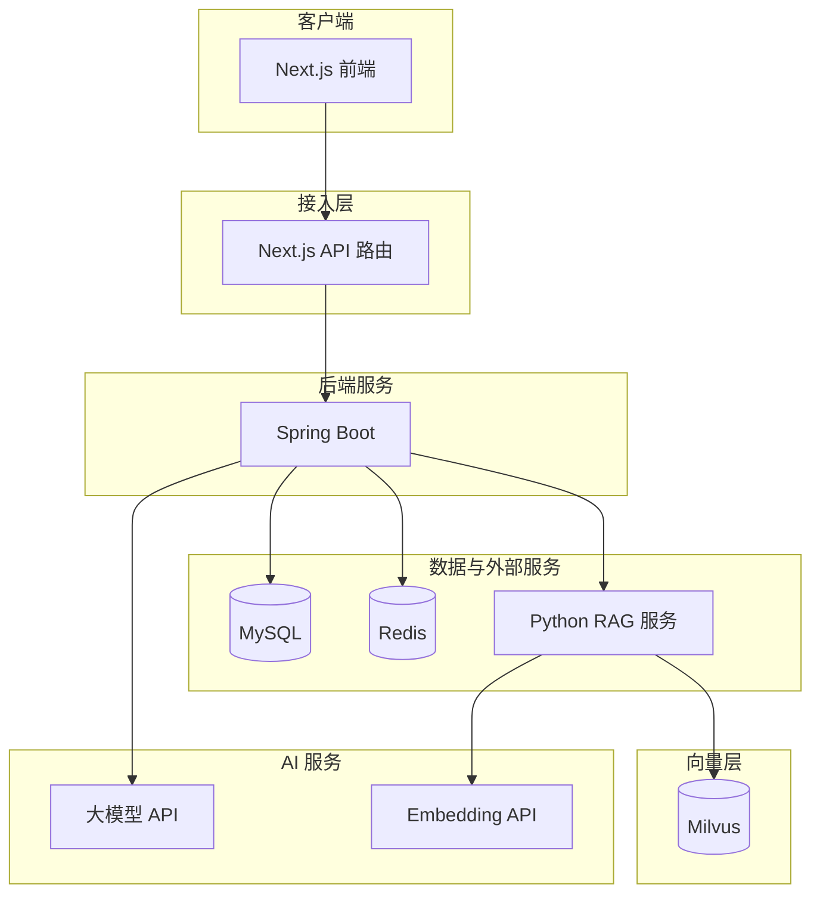
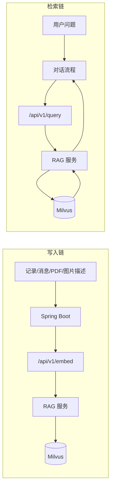
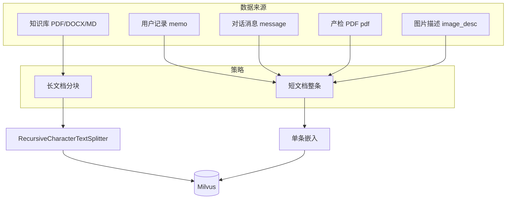
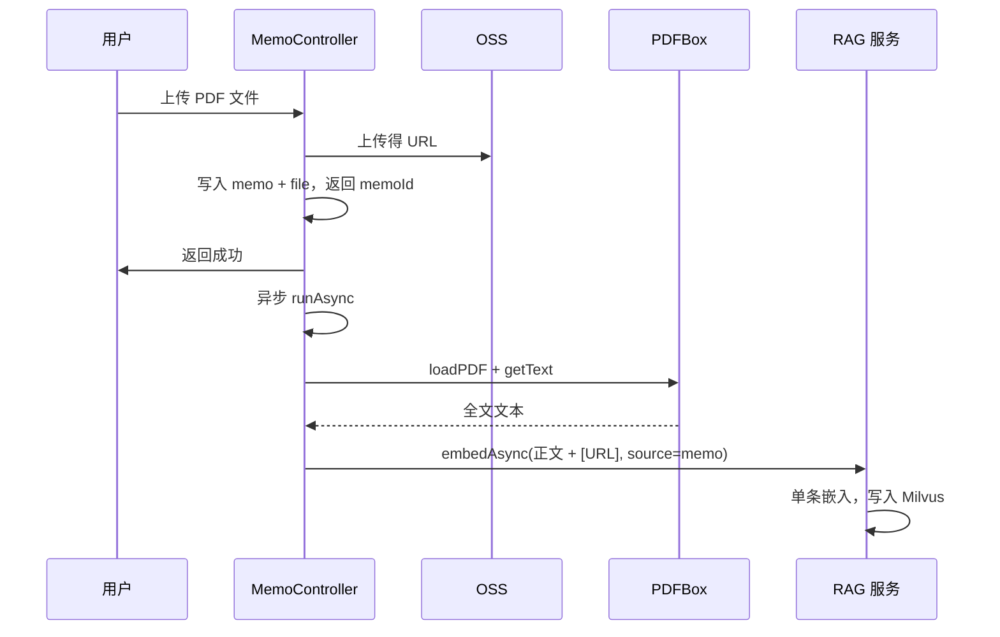
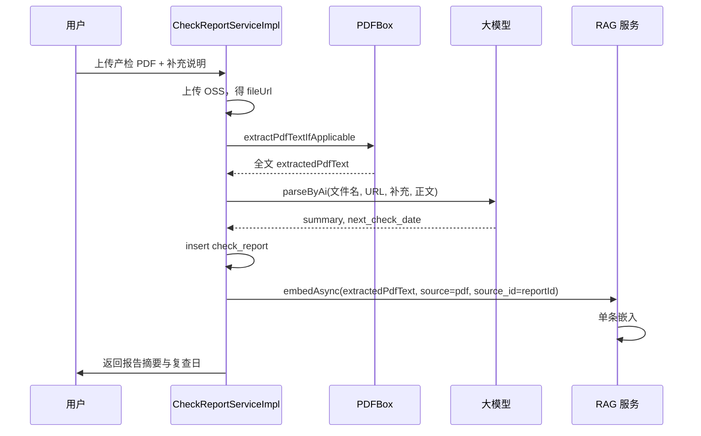
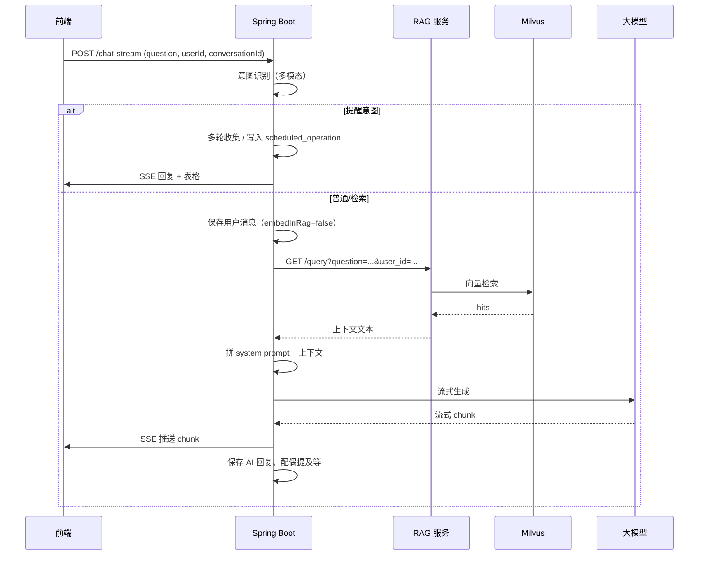
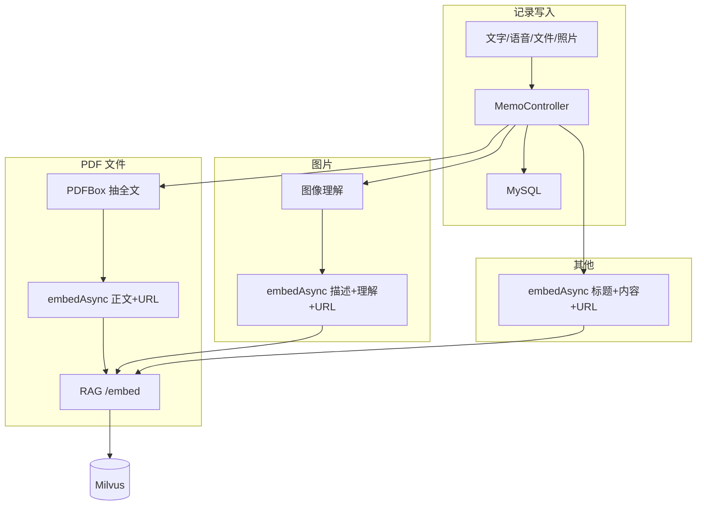

# 孕期宝 技术文档

## 一、系统架构概览

### 1.1 整体架构图



### 1.2 技术栈

| 层级 | 技术选型 | 说明 |
|------|----------|------|
| 前端 | Next.js, React | 同构渲染、API 路由代理、SSE 流式消费 |
| 后端 | Spring Boot 3.x, Java 17+ | REST、SSE、MyBatis、Spring Cache、调度 |
| 关系库 | MySQL 8 | 用户、记录、会话、家庭、任务、通知等 |
| 缓存 | Redis | Spring Cache 注解缓存，用户/家庭成员等热点 |
| 向量库 | Milvus | 统一集合 yunji_rag，按 user_id 区分私有与百科 |
| RAG 服务 | Python FastAPI | 嵌入、检索、百科构建；与 Java 通过 HTTP 解耦 |
| AI | 大模型 API（如 OpenAI 兼容） | 对话、意图识别、图像理解、图生图、提示词模板 |

---

## 二、向量数据库与检索增强（RAG）

### 2.1 向量库在系统中的地位

业务数据（记录、消息等）存储在 MySQL；**可检索的文本**通过独立 RAG 服务写入 Milvus，对话时再按问题检索，形成「向量数据库 + 关系数据库」协同：关系库做写入与权限，向量库做语义检索。



### 2.2 向量库设计（Milvus）

- **集合**：`yunji_rag`（用户私有 + 百科统一，用 `user_id` 区分）。
- **字段**：`id`（主键）、`vector`（1024 维）、`text`、`user_id`、`source`、`source_id`、`upload_time`。
- **索引**：向量字段 AUTOINDEX，内积（IP）相似度。
- **写入方**：仅 RAG 服务（Python）执行插入；Java 通过 HTTP 调用 `/api/v1/embed` 提交文本与元数据，由 RAG 服务向量化后写入。

### 2.3 多源异构数据的向量分块策略

系统存在**多源异构**数据写入向量库：长文档（知识库 PDF/DOCX/MD）、短文档（单条记录、单条消息、图片描述、产检摘要等）。不同来源采用不同策略，以兼顾检索质量与存储效率。



#### 2.3.1 长文档（知识库）分块策略

- **适用来源**：RAG 服务侧「百科」构建，即 `knowledge` 目录下的 PDF、DOCX、MD 文件；写入时 `user_id=-1`，供全局检索。
- **加载方式**：  
  - **PDF**：使用 LangChain 的 `PyPDFLoader` 按页加载，得到多个 `Document`（每页一段 page_content）。  
  - **DOCX**：使用 python-docx 按段落拼接为一段正文，再包装为一个 `Document`。  
  - **MD**：读入文件内容为一个 `Document`。
- **分块参数**：  
  - 使用 `RecursiveCharacterTextSplitter`：`chunk_size=1500`（字符）、`chunk_overlap=100`。  
  - 分隔符优先级：`["\n\n", "\n", "。", "！", "？", "；", " ", ""]`，优先按段落与句子切分，减少截断语义。  
  - 长度按字符数（`len`）计算，保证中文与英文混合时块大小可控。
- **清洗**：分块前对原始文本做 `clean_text`：去除页眉页脚（如 `—1—`、`第 N 页`）、多余空行与纯数字行、多余空格与 `\r`，再送入分块。
- **写入**：每个 chunk 单独调用 Embedding API 得到 1024 维向量，插入 `yunji_rag`，`source` 为文件名，`source_id` 可为空或块序号；同一文件产生多条向量。

**设计理由**：长文档若整篇嵌入，单向量难以细粒度匹配用户问题；按 1500 字左右分块并重叠 100 字，既保留上下文连贯又提高检索命中率。

#### 2.3.2 短文档（整条）策略——不分块

- **适用来源**：  
  - 用户文字/语音/文件/照片记录（source=memo）；  
  - 对话消息（source=message）；  
  - 产检 PDF 抽取全文（source=pdf）；  
  - 图片描述+理解结果（source=image_desc）。
- **特点**：单条内容长度有限（通常数百字至数千字），语义完整、自带边界（一条记录、一条消息、一份报告、一张图描述），因此**不做分块**，一条原文对应一条向量。
- **流程**：  
  - **Java 侧**：在 MemoController、MessageServiceServiceImpl、CheckReportServiceImpl 等处，将「待检索文本」拼成一段（如标题+正文+`[URL] xxx`），若超长则截断到 10000 字以内，然后调用 `RagService.embedAsync(userId, text, source, sourceId)`。  
  - **RAG 服务**：`/api/v1/embed` 收到 body 后，对 `text` 做 `strip()[:10000]`，调用一次 Embedding API，将得到的向量与 `user_id`、`source`、`source_id`、`upload_time` 一起插入 `yunji_rag`，**不经过 RecursiveCharacterTextSplitter**。  
  - **PDF 文件记录**：用户上传的 PDF 在 **Java 侧**用 Apache PDFBox（`PDFTextStripper`）抽取全文，再将「抽取正文 + [URL] 文件链接」整段传入 `embedAsync`，在 RAG 侧同样整段嵌入，不在 Python 侧再分块。  
  - **产检 PDF**：CheckReport 上传后，Java 用 PDFBox 抽全文，抽完的文本整段送入 `embedAsync`，source=pdf，source_id=reportId；RAG 侧仍为单条嵌入。
- **设计理由**：短文档本身是独立语义单元，分块会割裂「一条记录/一条消息/一份报告」的完整性，检索时更希望整条命中；且条数可控，单条一向量不会造成向量量级膨胀。

#### 2.3.3 策略对比小结

| 来源 | 数据类型 | 分块 | 单条长度上限 | 执行位置 |
|------|----------|------|--------------|----------|
| 知识库 PDF/DOCX/MD | 长文档 | 是，1500/100 | 无（按块） | Python RAG 服务 |
| 用户记录 memo | 短文档 | 否 | 10000 字 | Java → RAG 单条 |
| 对话消息 message | 短文档 | 否 | 10000 字 | Java → RAG 单条 |
| 产检 PDF pdf | 短文档（抽取全文） | 否 | 10000 字 | Java 抽正文 → RAG 单条 |
| 图片描述 image_desc | 短文档 | 否 | 10000 字 | Java → RAG 单条 |

对**多源异构**数据的统一约定：  
- **长文档、多页/多段**：在 RAG 服务内用统一分块器与清洗流程，保证检索粒度细、可复用于多种知识文件。  
- **短文档、单条语义**：在业务侧组好文本后，整条送入 RAG，不分块，保证「一条即一单元」，检索结果可直接对应到某条记录、某条消息或某份报告。

---

## 三、PDF 解析与文本抽取

系统中有两处涉及 PDF 正文抽取：**用户上传的文件记录（含 PDF）** 与 **产检单上传**；知识库百科的 PDF 则在 **Python RAG 服务** 中加载并分块。三者在流程与用途上有所区分。

### 3.1 用户文件记录中的 PDF（Java）

- **场景**：用户在「上传文件」时选择 PDF，系统需将 PDF 正文抽取后写入向量库，便于后续对话检索到该文件内容，并保留文件 URL。
- **实现**：  
  - 使用 **Apache PDFBox**：`Loader.loadPDF(byte[])` 得到 `PDDocument`，`PDFTextStripper.getText(doc)` 抽取全文。  
  - 抽取在 **异步线程**中执行（`CompletableFuture.runAsync`），不阻塞接口返回；抽取结果与文件 URL 拼成「正文 + \n[URL] + fileUrl」，调用 `ragService.embedAsync(userId, text, "memo", memoId)`。  
  - 若抽取失败或为空，仅打日志，不写入向量库；非 PDF 文件不抽取，仅用「标题 + [URL]」嵌入。
- **流程简图**：



### 3.2 产检单 PDF（Java）

- **场景**：用户上传产检 PDF，需要解析出「摘要」与「建议复查日期」，并把抽取正文写入向量库，便于日后对话中检索到该报告。
- **实现**：  
  - 同样使用 **Apache PDFBox**：`extractPdfTextIfApplicable(MultipartFile)` 判断扩展名为 `.pdf` 后，读入字节并 `Loader.loadPDF(...)` + `PDFTextStripper.getText(doc)` 得到全文。  
  - 全文与文件名、URL、用户补充说明一起传入 `parseByAi`：调用大模型按 `check_report_extract` 提示词解析出 `summary`、`next_check_date`，写入 `check_report` 表。  
  - 若抽取正文非空且 `reportId` 已生成，再调用 `ragService.embedAsync(userId, extractedPdfText, "pdf", reportId)`，**整段**写入向量库，不分块。
- **流程简图**：



### 3.3 知识库 PDF/DOCX/MD（Python RAG 服务）

- **场景**：运营或管理员将政策、百科类 PDF/DOCX/MD 放入 `knowledge` 目录，通过 RAG 服务的一键构建或百科嵌入接口，写入向量库（user_id=-1），供全局检索。
- **实现**：  
  - **PDF**：使用 LangChain 的 `PyPDFLoader` 按页加载为多个 `Document`，再经 `RecursiveCharacterTextSplitter` 分块（chunk_size=1500，overlap=100），每块 `clean_text` 后调用 Embedding API，插入 `yunji_rag`。  
  - **DOCX**：使用 python-docx 读段落，拼成一段 `Document`，再经同一分块器分块后嵌入。  
  - **MD**：读入为一段 `Document`，同样分块后嵌入。  
- **与 Java 侧差异**：知识库为「长文档、多文件」，在 RAG 服务内统一做分块与清洗；Java 侧 PDF 为「单份用户文档」，整篇抽取后整篇嵌入，不再在 Python 中分块。

---

## 四、图数据库与关系模型融合

### 4.1 当前：关系库中的“图结构”

系统**未单独部署图数据库**（如 Neo4j），但业务模型在 MySQL 中天然形成一张**关系图**：用户-家庭-成员-记录-会话-消息-任务-通知等，节点为实体，边为外键与关联查询。该图用于权限、可见范围、任务分配与通知对象等。

```mermaid
erDiagram
    User ||--o{ Memo : 拥有
    User ||--o{ Conversation : 拥有
    User ||--o| Family : 创建
    Family ||--o{ FamilyMember : 包含
    User ||--o{ FamilyMember : 属于
    Memo }o--|| Text : 1-1
    Memo }o--|| Voice : 1-1
    Memo }o--o{ Photo : 1-n
    Memo }o--|| File : 1-1
    Conversation ||--o{ Message : 包含
    FamilyMember }o--o{ FamilyTask : 分配
    User ||--o{ UserNotification : 接收
```

- **用途**：  
  - 判断「某条记录是否对某家庭成员可见」：需查 user → family_member、memo.visibility_mode/visible_to、user.share_scope。  
  - 判断「当前用户是否为配偶」：查 family_member.relationship、is_spouse。  
  - 任务分配与通知：family_task.assignee_user_id、user_notification.user_id、related_task_id。  
- **与向量的融合**：检索时带 `user_id`，只查该用户私有向量 + 可选百科；嵌入时带 `source`/`source_id`，便于追溯来自哪条记录/哪条消息/哪份报告。权限与归属在 MySQL 中按图关系计算，向量库只做语义检索，由 Java 统一编排。

### 4.2 图数据库（Neo4j）的引入与融合设想

若后续引入 **图数据库（如 Neo4j）**，可将「用户-家庭-成员-记录」等显式建为图节点与边，用于**多跳关系推理**，并与向量检索结合，形成「图 + 向量」双检索。

- **图侧**：  
  - 节点：User、Family、Member、Memo、Conversation、Message、Task 等。  
  - 边：CREATES_FAMILY、MEMBER_OF、OWNS_MEMO、VISIBLE_TO、ASSIGNED_TO 等。  
  - 查询示例：「配偶可见的、标签为 letter_to_baby 的记录」可写为多跳图查询，再取 memo_id 列表。  
- **向量侧**：仍用 Milvus 做语义检索，得到候选 record/message/report 的 source_id。  
- **融合方式**：  
  - 先图后向量：先用图查询得到「允许访问的 memo_id 集合」，再在向量检索结果中过滤，只保留在该集合内的 source_id。  
  - 先向量后图：先向量检索得到候选，再在图或 MySQL 中做可见性校验，过滤掉当前用户无权查看的项。  
- **创新点**：图负责「谁能看谁」的关系约束，向量负责「和问题最相关的内容」；二者结合既可保证权限正确，又可提升检索相关性。当前项目用 MySQL 关系查询已实现等价逻辑，图库可作为扩展选项，在需要复杂多跳关系（如「我配偶的配偶可见的记录」）时再迁移或双写。

---

## 五、Redis 缓存技术

### 5.1 缓存架构

```mermaid
flowchart LR
    subgraph app [应用层]
        Service[业务服务]
    end
    subgraph cache [缓存层]
        Redis[(Redis)]
    end
    subgraph db [持久层]
        MySQL[(MySQL)]
    end
    Service -->|@Cacheable 读| Redis
    Service -->|Cache 未命中/写| MySQL
    Redis -->|失败降级| MySQL
```

### 5.2 配置要点

- **CacheManager**：基于 `RedisCacheManager`，默认 TTL 10 分钟，Key/Value 使用 String + JSON 序列化。
- **命名空间**：`user`（用户信息，TTL 10 分钟）、`familyMembers`（家庭成员列表，TTL 5 分钟）等。
- **User 缓存**：专用序列化（不写 `@class`），兼容旧键值；`@Cacheable(value = "user", key = "#userId", unless = "#result == null")`。

### 5.3 容错与“永久可用”策略

- **CacheErrorHandler**：实现 `CachingConfigurer`，对 Get/Put/Evict/Clear 四类错误仅打 WARN 日志，**不向上抛异常**。因此 Redis 不可用或写失败（如 RDB 持久化失败导致 MISCONF）时，请求仍走 MySQL，业务不中断。
- **可选依赖**：Redis 作为加速层，非强依赖；未配置或连接失败时，仅缓存失效，不影响核心流程。

---

## 六、核心业务流程

### 6.1 流式对话与 RAG 串联



### 6.2 记录写入与向量嵌入（含 PDF/图片）



- 文字/语音：内容 + `[URL]` 异步嵌入。  
- 文件：非 PDF 用标题+URL；PDF 在 Java 侧 PDFBox 抽全文后「正文+[URL]」异步嵌入。  
- 照片：先图像理解，再「描述+理解结果+[URL]」异步嵌入。

### 6.3 定时提醒与改写


到期的 `scheduled_operation` 经 LLM 改写为“当前场景”话术后再下发。

---

## 七、技术创新点小结

1. **多源异构分块策略**：长文档（知识库）在 RAG 侧统一分块（1500/100）与清洗；短文档（记录、消息、产检摘要、图片描述）整条嵌入，兼顾检索粒度与语义完整。
2. **PDF 双路径**：用户 PDF 与产检 PDF 在 Java 侧用 PDFBox 抽取，整段送入向量库；知识库 PDF 在 Python 侧用 PyPDFLoader 加载并分块，统一由 RAG 服务写入。
3. **向量库与业务库分工**：MySQL 管权限与一致性，Milvus 管语义检索；通过 `user_id`、`source`/`source_id` 实现多租户与可追溯。
4. **检索轮次不嵌入**：避免“找图/搜记录”类问题污染向量集。
5. **关系图与向量融合**：用 MySQL 关系模型表达“图结构”，检索时带 user_id 与可见性；图数据库（Neo4j）可作为扩展，实现多跳关系与向量检索联合。
6. **Redis 容错**：缓存层错误不向上抛出，保证 Redis 故障时系统仍可长期依赖 MySQL。
7. **多模态意图与统一对话流**：单一路径支持文本/图片、找图/生成图/提醒/写信等，通过意图识别与 RAG/提醒分支分流。

以上技术文档覆盖架构、向量与分块、PDF 解析、图数据库融合设想、Redis 与核心流程，供评审与后续演进参考。
