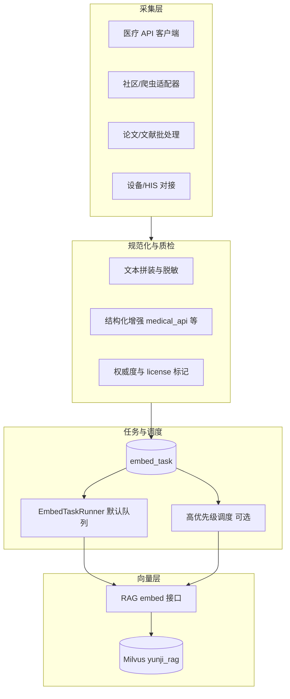

# 孕期宝 · 外部数据扩展技术方案

> 版本：v1.0  
> 创建日期：2026-03-20  
> 状态：技术方案（待评审/分阶段实施）  
> 基线架构：[多源异构数据处理详细文档](./多源异构数据处理详细文档.md)（v2.0，embed_task + RAG + Milvus）

---

## 一、方案摘要

在现有 **embed_task → EmbedTaskRunner → RAG `/api/v1/embed`** 链路上，扩展**外部搜集/对接数据**的接入能力：统一仍通过嵌入任务（或可审计的直连嵌入）进入 Milvus，并增加**来源标识、质量与新鲜度、优先级、结构化文本增强**等能力，满足医疗 API、社区内容、论文摘要等多类外部源，同时控制合规与性能风险。

**与 v2.0 的关系**：不推翻现有设计；在 `source` 语义、表结构、调度策略、RAG 写入前处理上**增量扩展**。

---

## 二、目标架构（抽象）



**设计原则**：

1. **外部数据默认走 embed_task**：与用户侧 memo/message 一致，可重试、可审计、可对账。
2. **极高时效场景**可经评审后采用 `RagService.embedSync` 旁路，但必须写**结构化审计日志**（不可静默直连）。
3. **全局知识**继续可用 `user_id = -1`；更细粒度隔离通过扩展 `user_id` 约定与检索 filter 实现（见下文）。

---

## 三、数据模型扩展（技术设计）

### 3.1 `source` 与 `source_id` 约定

| 新增 source（建议） | 含义 | source_id 建议形态 |
|---------------------|------|-------------------|
| `medical_api` | 医疗健康 API 快照条目 | 业务稳定键，如 `symptom:xxx` / `drug:yyy` |
| `community_post` | 社区公开帖（脱敏后） | `postId` 或 `platform:postId` |
| `research_paper` | 论文摘要 | `doi:xxx` 或 `cnki:xxx` |
| `device_data` | 穿戴设备聚合摘要 | `userId:date:metric`（须脱敏/聚合，慎用） |
| `third_party_record` | 第三方健康记录摘要 | 合作方 ID + 记录 ID |

**表结构**：将 `embed_task.source` 由 `VARCHAR(20)` 扩展为 **`VARCHAR(64)`～`VARCHAR(100)`**（与 Java 实体、`RelaxMusic` 等无冲突，需一次 DDL + 实体字段长度对齐）。

### 3.2 质量与血缘（可选列）

建议在 `embed_task` 上**按需**增加（可分_migration 实施）：

| 列名 | 类型 | 说明 |
|------|------|------|
| `external_source_key` | VARCHAR(100) | 采集器标识，如 `api.symptom_library` |
| `confidence_score` | DECIMAL(3,2) | 0.00–1.00，默认 1.0 |
| `freshness_days` | INT | 采集日至今天数（或由调度任务回填） |
| `license_info` | VARCHAR(200) | 许可/协议摘要或链接 |

检索侧若要用 `confidence_score` 加权，需在 **RAG 查询后处理**或 **Milvus 扩展标量字段**（当前 schema 仅 text/user_id/source/source_id/upload_time，加权需 RAG 或 Milvus 演进，属中期项）。

### 3.3 用户维度与隔离（约定）

| user_id 语义 | 用途 |
|--------------|------|
| `-1` | 全局公开百科（现状） |
| `>0` | 用户私有（现状） |
| 扩展约定（评审后落地） | 如机构共享：可用固定负值区间或单独 `tenant_id`（需 Milvus schema 变更，长期项） |

---

## 四、处理流水线（技术抽象）

### 4.1 采集器（Collector）接口形态（建议）

- **输入**：外部 API / 文件 / 消息队列  
- **输出**：规范化后的**纯文本**（或结构化模板拼成的文本）+ 元数据（source、source_id、user_id、confidence、license）  
- **落库**：调用 `EmbedTaskService.submitUpsert(userId, text, source, sourceId)`；若表已扩列，则扩展 Service 入参或旁路写扩展表。

### 4.2 结构化增强（RAG 侧或 Java 侧）

对 `medical_api` 等：在调用 embed 前将「指标 / 单位 / 参考范围 / 原文说明」拼成固定模板，避免表格语义完全丢失（可在 **Python `embed` 前 hook** 或 **Java 提交任务前**完成，优先单一职责：Java 负责业务拼装，Python 负责向量与入库）。

### 4.3 调度：默认队列 vs 高优先级

| 方案 | 说明 | 实现要点 |
|------|------|----------|
| **A. 任务优先级** | `embed_task` 增加 `priority INT`，Runner 先 `ORDER BY priority DESC, created_at` | 需改 Mapper SQL + Runner |
| **B. 双 Runner** | 高频 source 单独 `@Scheduled(fixedDelay = 2000)` 只捞 `medical_api` 等 | 实现快，注意并发与 DB 锁 |
| **C. 旁路 embedSync** | 仅审批通过的实时告警类 | 必须审计日志 + 监控 |

---

## 五、更新、淘汰与回滚

1. **版本化**：同一 `source + source_id` 新内容 → 新 upsert 覆盖 Milvus 中同键条目（与现有一致）；旧向量依赖 delete+upsert 或 RAG 侧 upsert 语义确认。  
2. **过期策略**：定时任务扫描元数据或业务表，`freshness_days > 阈值` → 创建 `delete` 任务或标记 stale，检索层降权。  
3. **按 source 批量下线**：`deleteBySourceId` 需扩展为**按 source 批量**（Milvus delete filter），或循环 source_id 列表（注意性能）。

---

## 六、合规、安全与性能

- **合法正当必要**：外部采集需法务/业务确认；涉及个人健康数据必须授权与脱敏。  
- **向量库体量**：监控 Milvus 实体数、查询 P99；外部数据建议配额与 TTL。  
- **测试**：沙箱 Milvus + 独立 `source` 前缀；生产按 source 灰度。

---

## 七、文档体系（规划）

| 文档 | 用途 |
|------|------|
| 本文档 | 技术方案总览与和 v2.0 的衔接 |
| `docs/外部数据接入规范.md`（待建） | 采集器开发标准、字段约定、评审清单 |
| `docs/外部数据源清单.md`（待建） | 已接入源、更新频率、Owner |
| [多源异构数据处理详细文档](./多源异构数据处理详细文档.md) | 当前已实施链路 |

---

## 八、实施阶段与「需要重新运行什么」

> **说明**：当前仓库若**仅新增本技术文档**，**不需要**执行任何构建或迁移。  
> 下列命令在**对应阶段开发完成并合并代码后**按行执行。

### 8.1 阶段 0：仅文档（当前）

| 动作 | 是否必须 |
|------|----------|
| 数据库迁移 | 否 |
| 后端编译/重启 | 否 |
| RAG 重启 | 否 |
| 前端构建 | 否 |

### 8.2 阶段 1：扩展 `source` 长度 + 首个外部采集器（Java）

| 步骤 | 操作 |
|------|------|
| 1 | 在 MySQL 执行新 migration（如 `ALTER TABLE embed_task MODIFY source VARCHAR(64) NOT NULL;`） |
| 2 | 同步修改 `EmbedTask` 实体、`EmbedTaskMapper` 注释/校验（若有长度校验） |
| 3 | 实现采集器并调用 `EmbedTaskService.submitUpsert` |
| 4 | **重新编译并重启后端**：`mvn clean package -DskipTests` → 重启 Spring Boot 进程（如端口 9677） |

### 8.3 阶段 2：`embed_task` 扩列（质量/血缘）

| 步骤 | 操作 |
|------|------|
| 1 | 执行 `ALTER TABLE embed_task ADD COLUMN ...` 的 migration |
| 2 | 更新实体、Mapper、Service 签名 |
| 3 | **重新编译并重启后端** |

### 8.4 阶段 3：RAG 结构化 enrich 或 Milvus 标量扩展

| 步骤 | 操作 |
|------|------|
| 1 | 修改 `backend/src/main/resources/py/app.py`（或独立服务）中 embed 前逻辑 / schema |
| 2 | **重启 RAG Python 服务**（如 `uvicorn app:app --host 0.0.0.0 --port 8004`） |
| 3 | 若 Java 仅调用方式不变，可不重启 Java；若请求体变更则需同步改 `RagService` 并重启后端 |

### 8.5 阶段 4：优先级队列 / 双 Runner

| 步骤 | 操作 |
|------|------|
| 1 | 改 `EmbedTaskMapper.selectPending` SQL + `EmbedTaskRunner`（或新增 Runner） |
| 2 | **重新编译并重启后端** |

### 8.6 前端

- 外部数据扩展**默认不强制**改前端；若管理台增加「数据源监控」页，则在改代码后执行：  
  `cd frontend && npm install && npm run build`（开发环境可用 `npm run dev`）。

### 8.7 一键检查清单（实施后）

```text
□ MySQL：已执行对应 migration，确认 embed_task 结构
□ 后端：Spring Boot 已重启，日志无 EmbedTaskRunner 连续报错
□ RAG：8004（或实际端口）健康检查通过
□ Milvus：集合可查，抽样 query 命中新 source
□（可选）监控：外部数据条数、失败任务数、API 延迟
```

---

## 九、下一步行动（管理视角）

1. 内部评审本方案与 Milvus/RAG 容量。  
2. 业务确认首批 1～2 个外部源（建议从 `medical_api` 或合规后的结构化指南开始）。  
3. 原型：单源端到端（采集 → embed_task → Milvus → 对话检索验证）。  
4. 灰度：按 source 小流量，保留按 source 下线能力。

---

## 十、参考

- [多源异构数据处理详细文档](./多源异构数据处理详细文档.md)  
- [users/多源异构数据处理方案.md](../users/多源异构数据处理方案.md)（原始改进思路）  
- 业务建议稿：《孕期宝多源异构数据处理改进建议（外部数据扩展）》2026-03-20

---

*本文档由业务建议稿抽象为可实施的技术方案，具体 DDL/API 以评审后提交的 migration 与代码为准。*
