# 孕期宝项目 UML 建模文档

> 基于 Spring Boot + Next.js 全栈项目
> 生成时间：2026-03-20
> 使用 PlantUML 语言绘制

---

## 一、用例图 (Use Case Diagram)

### 1.1 系统总体用例图

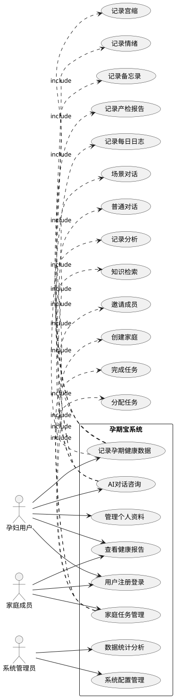

### 1.2 详细用例说明

| 用例编号 | 用例名称 | 参与者 | 描述 |
|---------|---------|--------|------|
| UC-001 | 用户注册登录 | 所有用户 | 用户通过用户名密码注册和登录系统 |
| UC-002 | 记录孕期健康数据 | 孕妇用户 | 记录备忘录、情绪、宫缩、每日日志、产检报告等 |
| UC-003 | AI对话咨询 | 孕妇用户 | 与AI进行孕期相关咨询对话 |
| UC-004 | 家庭任务管理 | 家庭成员 | 创建家庭、邀请成员、分配和完成任务 |
| UC-005 | 查看健康报告 | 孕妇用户、家庭成员 | 查看健康数据统计和分析报告 |
| UC-006 | 管理个人资料 | 所有用户 | 管理个人信息、隐私设置、头像等 |
| UC-007 | 数据统计分析 | 系统管理员 | 查看系统数据统计和分析 |
| UC-008 | 系统配置管理 | 系统管理员 | 管理系统配置和参数 |

---

## 二、类图 (Class Diagram)

### 2.1 核心实体类图

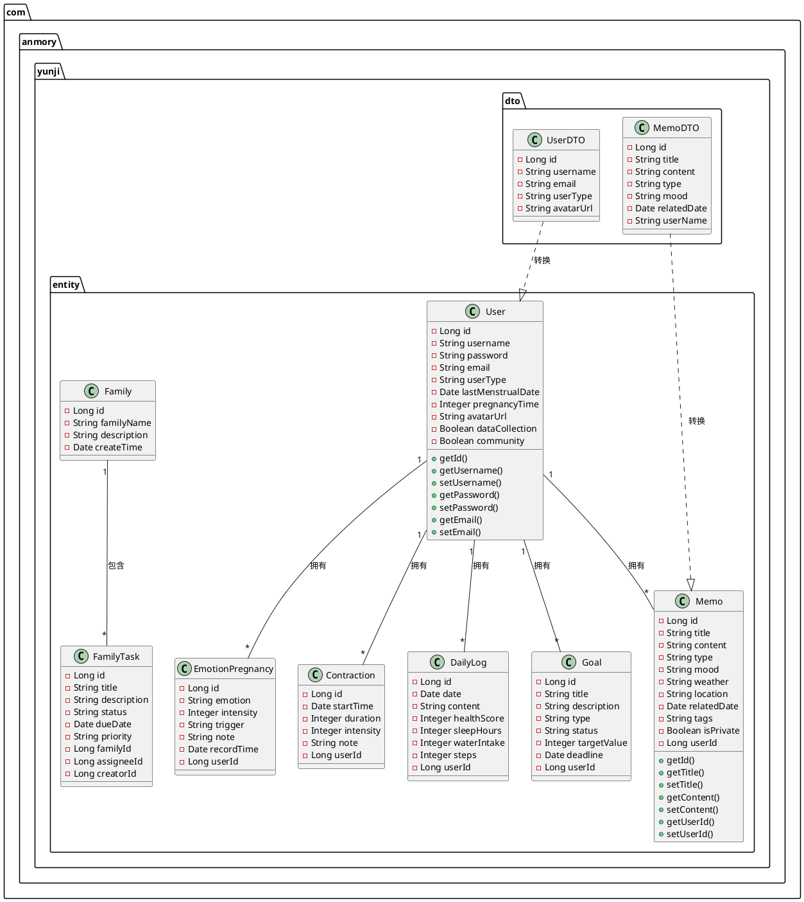

### 2.2 服务层类图

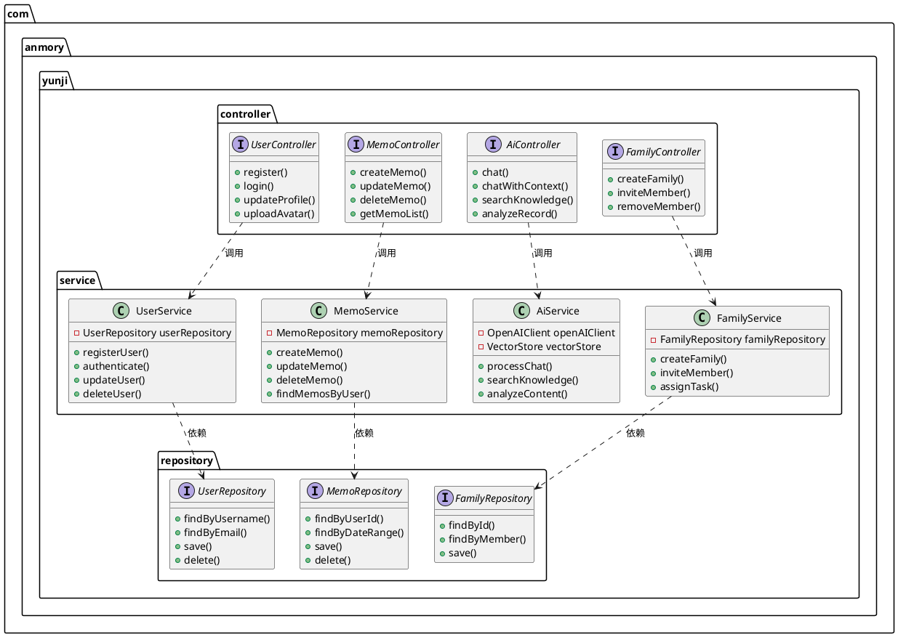

---

## 三、时序图 (Sequence Diagram)

### 3.1 用户注册时序图

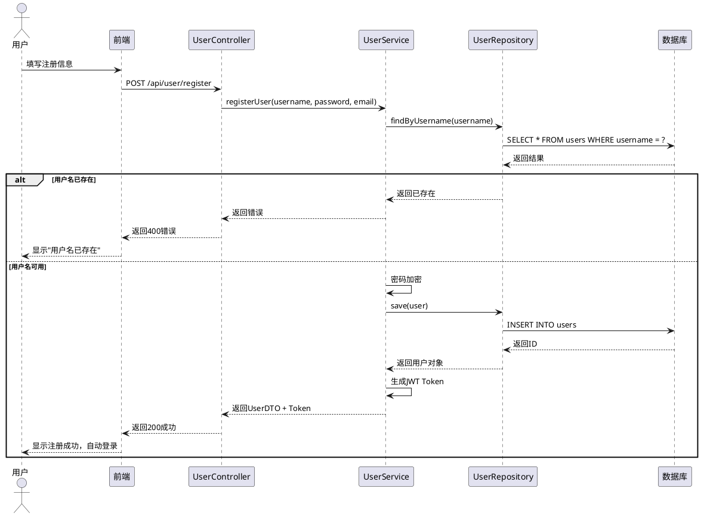

### 3.2 AI对话时序图

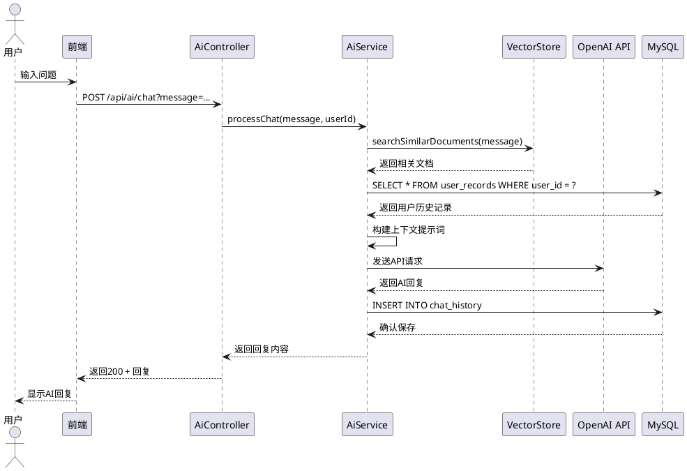

### 3.3 记录宫缩时序图

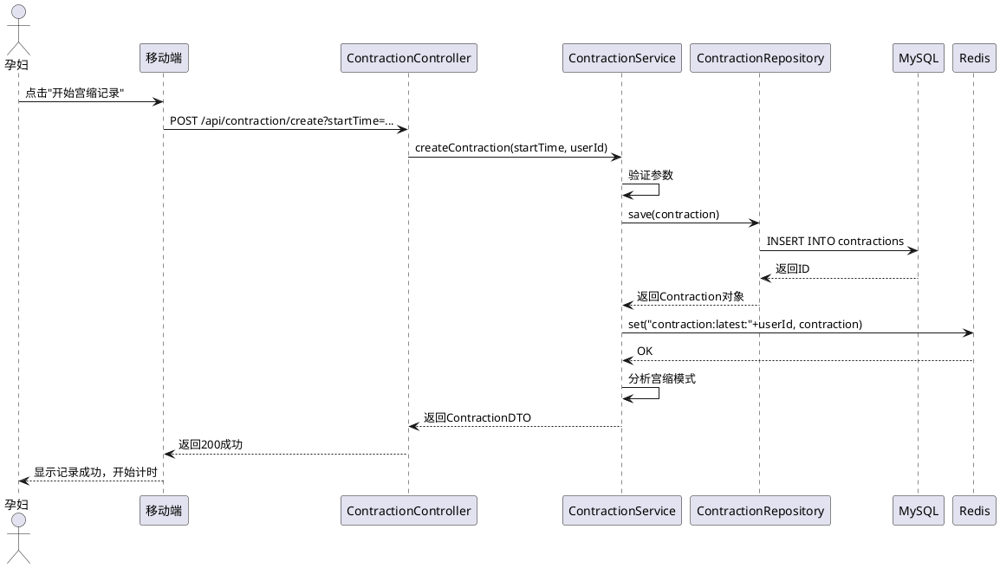

---

## 四、活动图 (Activity Diagram)

### 4.1 用户登录活动图

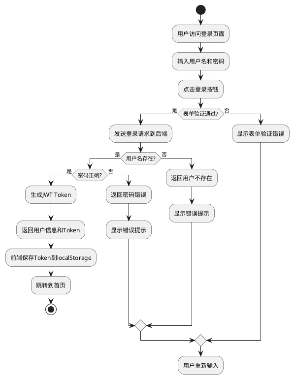

### 4.2 记录健康数据活动图

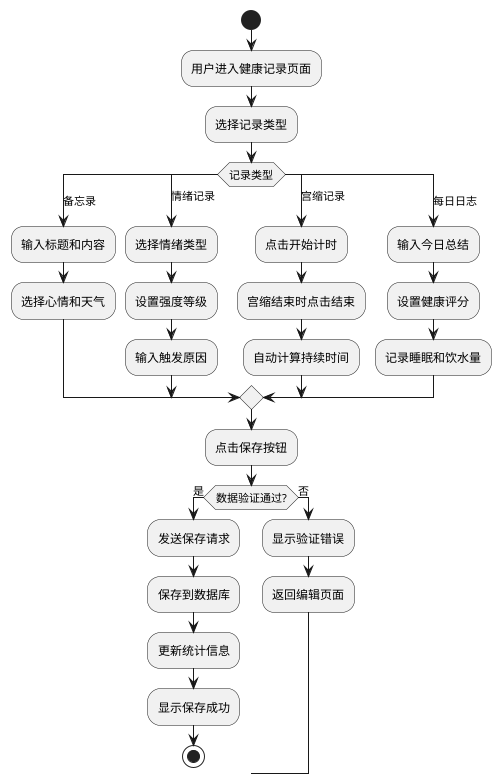

---

## 五、状态图 (State Diagram)

### 5.1 用户账户状态图

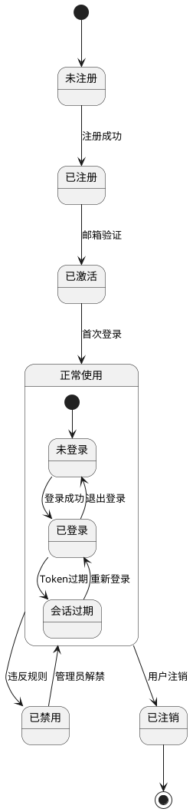

### 5.2 家庭任务状态图

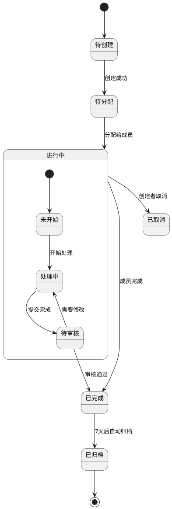

---

## 六、组件图 (Component Diagram)

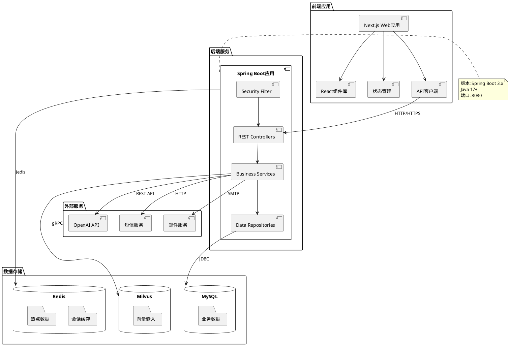

---

## 七、部署图 (Deployment Diagram)

```plantuml
@startuml
node "云服务器" as Server {
  node "Docker容器集群" as Docker {
    artifact "Nginx反向代理" as Nginx {
      file "nginx.conf"
    }
    
    artifact "Spring Boot应用" as Backend {
      file "yunji-backend.jar"
      database "H2内存数据库" as H2
    }
    
    artifact "Next.js前端" as Frontend {
      file "next-app"
    }
    
    artifact "MySQL数据库" as MySQL {
      folder "yunfu数据库"
      folder "31张业务表"
    }
    
    artifact "Redis缓存" as Redis {
      folder "会话存储"
      folder "热点缓存"
    }
    
    artifact "Milvus向量库" as Milvus {
      folder "yunji_rag集合"
      folder "向量索引"
    }
  }
}

node "用户设备" as UserDevice {
  device "手机浏览器" as MobileBrowser
  device "电脑浏览器" as PCBrowser
  device "微信小程序" as WechatMini
}

node "开发环境" as DevEnv {
  artifact "开发机器" as DevMachine
  artifact "Git仓库" as GitRepo
  artifact "CI/CD流水线" as CICD
}

Nginx --> Backend : 代理请求 8080
Nginx --> Frontend : 服务静态文件
Backend --> MySQL : 3306
Backend --> Redis : 6379
Backend --> Milvus : 19530

MobileBrowser --> Nginx : HTTPS 443
PCBrowser --> Nginx : HTTPS 443
WechatMini --> Backend : REST API

DevMachine --> GitRepo : 代码推送
GitRepo --> CICD : 触发构建
CICD --> Docker : 自动部署

note right of Docker
  使用docker-compose编排
  多容器隔离部署
  健康检查自动重启
end note
@enduml
```

---

## 八、包图 (Package Diagram)

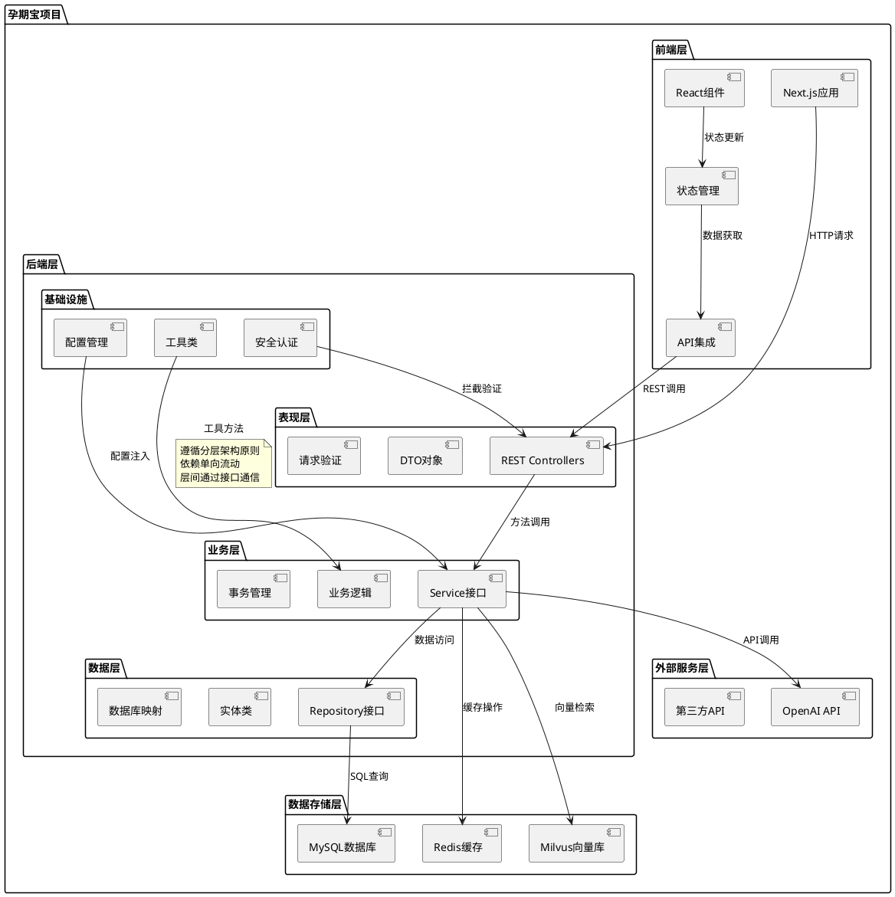

---

## 九、对象图 (Object Diagram)

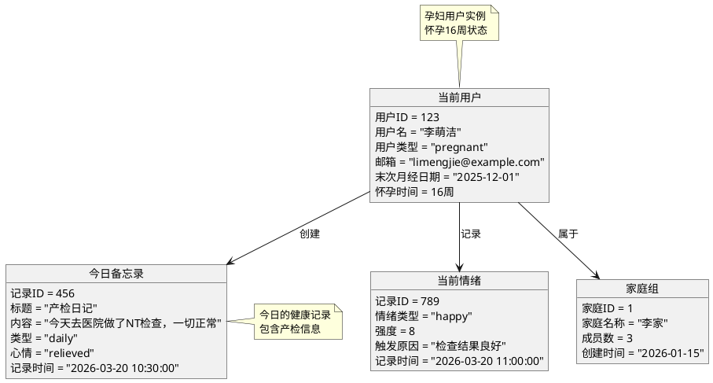

---

## 十、通信图 (Communication Diagram)

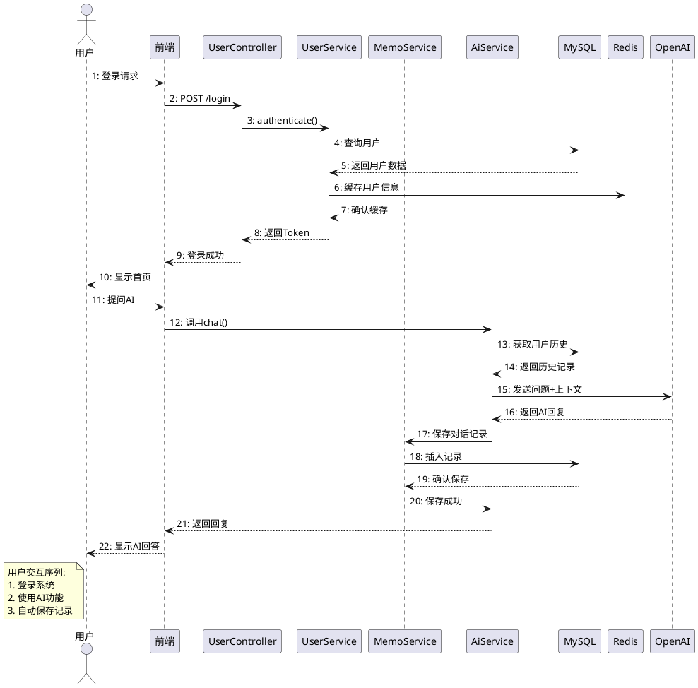

---

## 十一、交互概览图 (Interaction Overview Diagram)

```plantuml
@startuml
start
:用户访问系统;

ref 用户登录流程

if (登录成功?) then (是)
  :显示主界面;
  
  partition "健康记录模块" {
    ref 记录备忘录流程
    ref 记录情绪流程
    ref 记录宫缩流程
  }
  
  partition "AI咨询模块" {
    ref AI对话流程
    ref 知识检索流程
  }
  
  partition "家庭模块" {
    ref 家庭任务流程
  }
  
  :生成综合报告;
else (否)
  :显示登录错误;
  stop
endif

:用户退出系统;
stop

' 子流程定义
frame 用户登录流程 {
  :输入用户名密码;
  :验证凭证;
  :生成会话Token;
}

frame 记录备忘录流程 {
  :选择记录类型;
  :输入内容;
  :添加标签;
  :保存到数据库;
}

frame AI对话流程 {
  :输入问题;
  :检索相关知识;
  :调用AI模型;
  :返回回答;
}

frame 家庭任务流程 {
  :查看家庭任务;
  :领取或分配任务;
  :更新任务状态;
}
@enduml
```

---

## 十二、时序图补充 - 关键业务流程

### 12.1 多源异构数据处理时序图

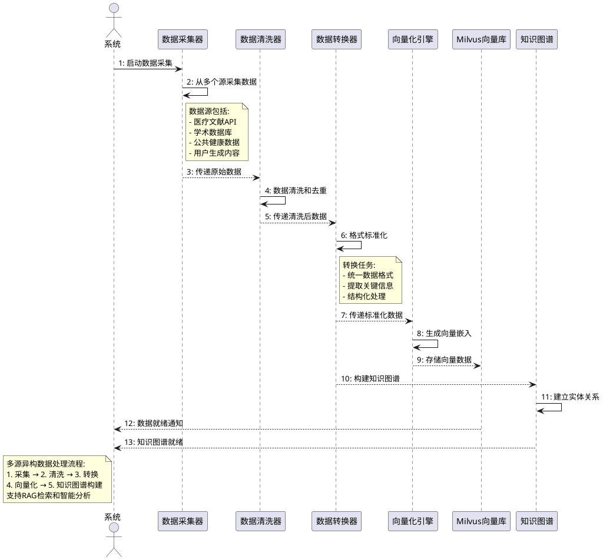

---

## 附录

### A. PlantUML 使用说明

#### A.1 环境配置
```bash
# 安装PlantUML
# 方式1: 使用在线版本 (https://www.plantuml.com/plantuml)
# 方式2: 本地安装
sudo apt-get install plantuml  # Ubuntu
# 或使用Docker
docker run -d -p 8080:8080 plantuml/plantuml-server:jetty
```

#### A.2 常用语法速查
```plantuml
' 基本元素
@startuml
actor 用户
participant 组件
database 数据库
queue 队列

' 关系箭头
用户 -> 组件 : 请求
组件 --> 用户 : 响应
组件 -> 组件 : 调用
组件 ..> 数据库 : 依赖

' 控制结构
alt 条件1
  :操作1;
else 条件2
  :操作2;
end

loop 每次
  :循环操作;
end

group 分组
  :操作A;
  :操作B;
end
@enduml
```

### B. UML图类型总结

| 图类型 | 用途 | 本项目示例 |
|--------|------|-----------|
| 用例图 | 系统功能需求，用户与系统交互 | 用户注册、健康记录、AI咨询 |
| 类图 | 系统静态结构，类之间的关系 | 实体类、DTO、Service、Repository |
| 时序图 | 对象间交互的时间顺序 | 用户登录、AI对话、数据记录 |
| 活动图 | 业务流程和工作流 | 登录流程、记录流程、审批流程 |
| 状态图 | 对象状态变化 | 用户状态、任务状态、订单状态 |
| 组件图 | 系统物理组件部署 | 前端、后端、数据库、缓存 |
| 部署图 | 系统运行环境配置 | 服务器、容器、网络拓扑 |
| 包图 | 代码组织结构和模块划分 | 分层架构、包依赖关系 |
| 对象图 | 特定时刻的对象实例 | 当前用户、今日记录、家庭信息 |
| 通信图 | 对象间消息传递（强调结构） | 系统组件间通信 |
| 交互概览图 | 多个交互流程的组合 | 完整业务流程概览 |

### C. 项目架构映射

#### C.1 UML图与代码对应关系
- **用例图** → `docs/02-需求文档.md` 中的功能需求
- **类图** → `backend/src/main/java/com/anmory/yunji/` 中的Java类
- **时序图** → `backend/src/main/java/com/anmory/yunji/controller/` 中的API端点
- **组件图** → `docker-compose.yml` 和部署配置
- **部署图** → 服务器环境和容器编排

#### C.2 技术栈对应
- **前端组件**：Next.js + React → 组件图中的前端层
- **后端服务**：Spring Boot → 组件图中的后端层
- **数据存储**：MySQL + Redis + Milvus → 数据存储层
- **外部服务**：OpenAI API → 外部服务层

---

## 文档转换说明

本Markdown文档包含完整的PlantUML代码，可通过以下方式转换为可视化UML图：

### 1. 在线转换
访问 [PlantUML在线服务器](https://www.plantuml.com/plantuml)，粘贴PlantUML代码即可生成图片。

### 2. 本地转换
```bash
# 安装PlantUML
sudo apt install plantuml

# 转换单个文件
plantuml -tsvg 孕期宝UML文档.md

# 批量转换所有UML图
plantuml -tsvg "**/*.puml"
```

### 3. IDE插件
- **VSCode**: PlantUML扩展
- **IntelliJ IDEA**: PlantUML integration插件
- **Eclipse**: PlantUML插件

### 4. 转换为DOCX
使用Python脚本将本Markdown文档转换为DOCX格式：
```python
# 需要安装: pip install python-docx markdown
python convert_to_docx.py 孕期宝UML文档.md
```

---

**文档维护**：
- 当项目代码变更时，需同步更新UML图
- 新增功能模块时，补充相应的UML图
- 定期审查架构图与实际代码的一致性

**版本记录**：
- v1.0 (2026-03-20): 初始版本，基于代码分析生成
- 下次更新：项目架构重大变更时