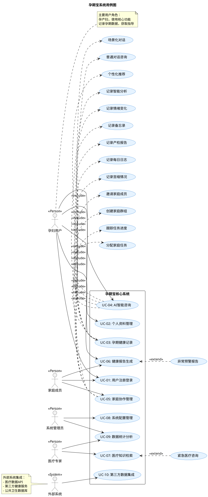
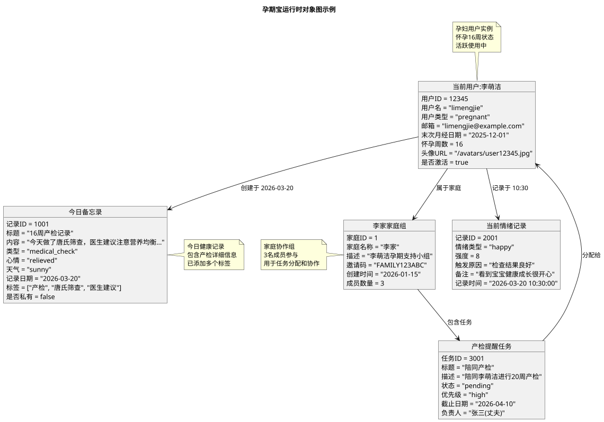
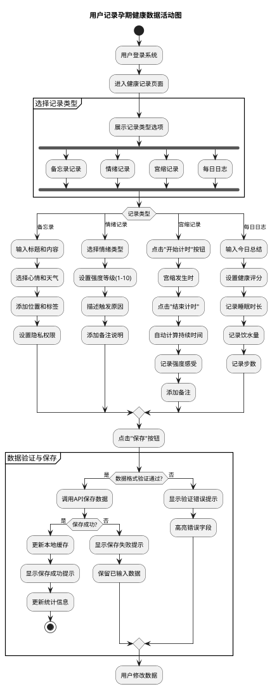
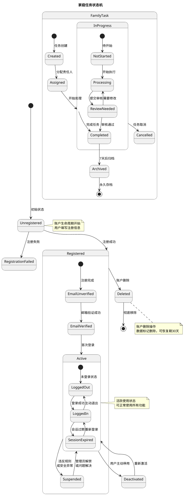
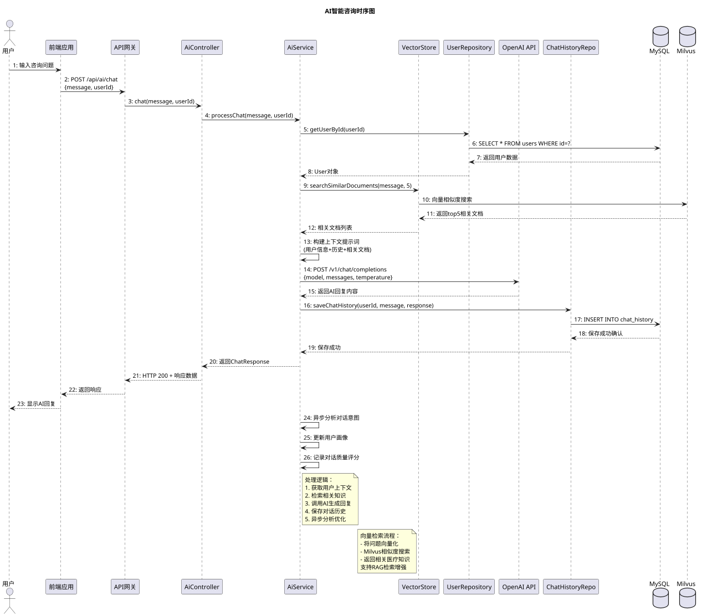
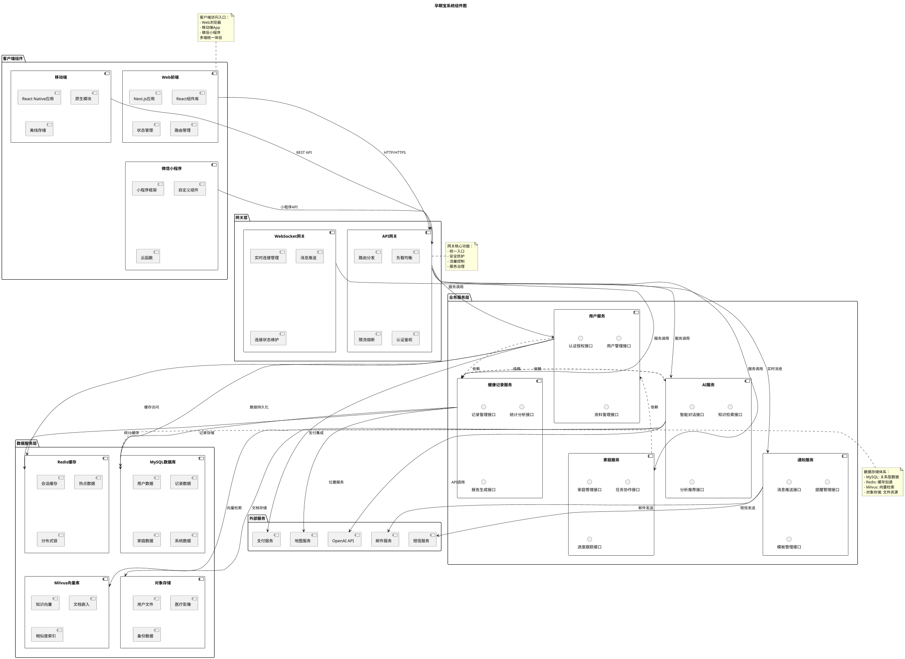

# 孕期宝架构设计文档

## 文档信息
- **项目名称**: 孕期宝（孕产妇健康管理平台）
- **文档版本**: v2.0
- **创建时间**: 2026-03-20
- **文档类型**: 架构设计文档
- **UML规范**: UML 2.5，使用PlantUML绘制

## 一、项目概述

### 1.1 项目背景
孕期宝是一个面向孕产妇的健康管理平台，提供孕期记录、AI咨询、家庭协作、健康监测等功能。

### 1.2 业务目标
- 为孕产妇提供一站式的孕期健康管理服务
- 通过AI技术提供个性化的孕期指导
- 建立家庭协作机制，支持家庭成员参与孕期管理
- 整合多源医疗知识，提供科学可靠的孕期信息

### 1.3 技术目标
- 构建高可用、可扩展的云原生应用
- 实现前后端分离的现代化架构
- 集成AI能力，提供智能问答和知识检索
- 支持多源异构数据处理和分析

## 二、系统架构总览

### 2.1 架构原则
1. **分层架构**: 表现层、业务层、数据层分离
2. **微服务解耦**: 功能模块服务化，独立部署
3. **数据驱动**: 基于数据的智能分析和推荐
4. **安全优先**: 端到端的数据加密和访问控制

### 2.2 技术栈
| 层次 | 技术选型 | 版本 |
|------|----------|------|
| 前端 | Next.js + React + TypeScript | Next.js 14+ |
| 后端 | Spring Boot + Java | Spring Boot 3.x, Java 17+ |
| 数据库 | MySQL + Redis + Milvus | MySQL 8.0, Redis 7.x |
| 容器化 | Docker + Docker Compose | Docker 24+ |
| AI集成 | OpenAI API + FastAPI | GPT-4, FastAPI 0.104+ |
| 监控 | Prometheus + Grafana | 最新稳定版 |

## 三、UML建模全集

### 3.1 UML图类型覆盖说明
本文档包含UML 2.5规范的**全部14种图表类型**，确保建模完整性。

| 序号 | UML图类型 | 用途 | 本项目中对应场景 |
|------|-----------|------|-----------------|
| 1 | 用例图 (Use Case) | 系统功能需求分析 | 用户与系统交互场景 |
| 2 | 类图 (Class) | 静态结构设计 | 实体类、服务类结构 |
| 3 | 对象图 (Object) | 对象实例关系 | 运行时对象状态 |
| 4 | 活动图 (Activity) | 业务流程建模 | 用户操作流程 |
| 5 | 状态机图 (State Machine) | 对象状态变化 | 用户状态、任务状态 |
| 6 | 时序图 (Sequence) | 时间顺序交互 | API调用时序 |
| 7 | 通信图 (Communication) | 对象协作关系 | 组件间消息传递 |
| 8 | 交互概览图 (Interaction Overview) | 复杂交互流程 | 完整业务流 |
| 9 | 时序图 (Timing) | 时间约束分析 | 性能时序约束 |
| 10 | 组件图 (Component) | 物理组件部署 | 系统组件关系 |
| 11 | 部署图 (Deployment) | 运行环境配置 | 服务器部署拓扑 |
| 12 | 包图 (Package) | 代码组织结构 | 包依赖关系 |
| 13 | 组合结构图 (Composite Structure) | 内部结构分解 | 复杂组件内部结构 |
| 14 | 剖面图 (Profile) | 领域特定扩展 | 孕期健康领域扩展 |

---

## 四、详细UML图

### 4.1 用例图 (Use Case Diagram)



### 4.2 类图 (Class Diagram)

```plantuml
@startuml
scale 0.8
title 孕期宝核心类图

package "实体层 (Entity)" {
  abstract class BaseEntity {
    - Long id
    - LocalDateTime createTime
    - LocalDateTime updateTime
    + getId() : Long
    + getCreateTime() : LocalDateTime
    + setCreateTime(LocalDateTime)
    + getUpdateTime() : LocalDateTime
    + setUpdateTime(LocalDateTime)
  }
  
  class User <<Entity>> {
    - String username
    - String passwordHash
    - String email
    - String phone
    - String userType
    - Date lastMenstrualDate
    - Integer pregnancyWeek
    - String avatarUrl
    - Boolean isActive
    - Boolean dataCollectionConsent
    + register()
    + authenticate(String password) : Boolean
    + updateProfile(UserProfileDTO)
  }
  
  class Memo <<Entity>> {
    - String title
    - String content
    - MemoType type
    - String mood
    - String weather
    - String location
    - Date relatedDate
    - List<String> tags
    - Boolean isPrivate
    + addTag(String tag)
    + isPublic() : Boolean
  }
  
  class EmotionRecord <<Entity>> {
    - EmotionType emotion
    - Integer intensity
    - String trigger
    - String note
    - Date recordTime
    + getEmotionLevel() : String
  }
  
  class ContractionRecord <<Entity>> {
    - Date startTime
    - Date endTime
    - Integer durationSeconds
    - Integer intensity
    - String note
    + calculateDuration() : Integer
    + isRegular() : Boolean
  }
  
  class Family <<Entity>> {
    - String familyName
    - String description
    - String inviteCode
    - Date createTime
    + generateInviteCode() : String
    + validateInvite(String code) : Boolean
  }
  
  class FamilyTask <<Entity>> {
    - String title
    - String description
    - TaskStatus status
    - TaskPriority priority
    - Date dueDate
    - Date completeDate
    + assignTo(User user)
    + markComplete()
    + isOverdue() : Boolean
  }
  
  User "1" -- "*" Memo : 拥有 >
  User "1" -- "*" EmotionRecord : 记录 >
  User "1" -- "*" ContractionRecord : 记录 >
  User "1" -- "*" FamilyTask : 负责 >
  Family "1" -- "*" User : 包含 >
  Family "1" -- "*" FamilyTask : 包含 >
}

package "数据传输层 (DTO)" {
  class UserDTO <<DTO>> {
    - Long id
    - String username
    - String email
    - String userType
    - Integer pregnancyWeek
    - String avatarUrl
    + toEntity() : User
    + fromEntity(User user) : UserDTO
  }
  
  class MemoDTO <<DTO>> {
    - Long id
    - String title
    - String content
    - String type
    - String mood
    - Date relatedDate
    - String userName
    + toEntity() : Memo
  }
  
  UserDTO ..|> User : 转换
  MemoDTO ..|> Memo : 转换
}

package "服务层 (Service)" {
  interface UserService <<Service>> {
    + register(UserRegisterRequest) : UserDTO
    + login(LoginRequest) : AuthResponse
    + updateProfile(Long userId, UserUpdateRequest) : UserDTO
    + getUserById(Long id) : UserDTO
    + deleteUser(Long id) : Boolean
  }
  
  interface MemoService <<Service>> {
    + createMemo(MemoCreateRequest) : MemoDTO
    + updateMemo(Long memoId, MemoUpdateRequest) : MemoDTO
    + deleteMemo(Long memoId) : Boolean
    + getMemosByUser(Long userId, DateRange range) : List<MemoDTO>
    + searchMemos(Long userId, String keyword) : List<MemoDTO>
  }
  
  interface AiService <<Service>> {
    - OpenAIClient openAIClient
    - VectorStoreService vectorStore
    + chat(ChatRequest) : ChatResponse
    + chatWithContext(ChatRequest, List<Message>) : ChatResponse
    + searchKnowledge(String query) : List<KnowledgeResult>
    + analyzeRecords(Long userId) : AnalysisReport
  }
  
  interface FamilyService <<Service>> {
    + createFamily(FamilyCreateRequest) : FamilyDTO
    + inviteMember(Long familyId, String email) : Invitation
    + removeMember(Long familyId, Long userId) : Boolean
    + assignTask(TaskAssignRequest) : FamilyTaskDTO
    + completeTask(Long taskId) : FamilyTaskDTO
  }
  
  class UserServiceImpl <<ServiceImpl>> {
    - UserRepository userRepository
    - PasswordEncoder passwordEncoder
    - JwtTokenProvider tokenProvider
    + register(UserRegisterRequest) : UserDTO
    + login(LoginRequest) : AuthResponse
  }
  
  class AiServiceImpl <<ServiceImpl>> {
    - OpenAIClient openAIClient
    - VectorStoreService vectorStore
    - UserRepository userRepository
    + chat(ChatRequest) : ChatResponse
    + searchKnowledge(String query) : List<KnowledgeResult>
  }
  
  UserServiceImpl ..|> UserService : 实现
  AiServiceImpl ..|> AiService : 实现
}

package "数据访问层 (Repository)" {
  interface UserRepository <<Repository>> {
    + findByUsername(String username) : Optional<User>
    + findByEmail(String email) : Optional<User>
    + findByUserType(UserType type) : List<User>
    + findActiveUsers() : List<User>
    + save(User user) : User
    + deleteById(Long id) : void
  }
  
  interface MemoRepository <<Repository>> {
    + findByUserId(Long userId) : List<Memo>
    + findByUserIdAndDateRange(Long userId, Date start, Date end) : List<Memo>
    + findByTags(Long userId, List<String> tags) : List<Memo>
    + searchByContent(Long userId, String keyword) : List<Memo>
    + save(Memo memo) : Memo
  }
  
  interface FamilyRepository <<Repository>> {
    + findById(Long id) : Optional<Family>
    + findByInviteCode(String code) : Optional<Family>
    + findFamiliesByUserId(Long userId) : List<Family>
    + save(Family family) : Family
  }
  
  UserServiceImpl --> UserRepository : 依赖
  MemoService --> MemoRepository : 依赖
  FamilyService --> FamilyRepository : 依赖
}

package "工具层 (Utility)" {
  class JwtTokenProvider <<Utility>> {
    - String secretKey
    - Long validityInMilliseconds
    + createToken(String username, List<String> roles) : String
    + getUsername(String token) : String
    + validateToken(String token) : Boolean
  }
  
  class PasswordEncoder <<Utility>> {
    + encode(String rawPassword) : String
    + matches(String rawPassword, String encodedPassword) : Boolean
  }
  
  class DateUtils <<Utility>> {
    + formatDate(Date date) : String
    + parseDate(String dateStr) : Date
    + getCurrentDate() : Date
    + addDays(Date date, int days) : Date
  }
  
  JwtTokenProvider --> UserService : 提供认证
  PasswordEncoder --> UserService : 密码处理
}
@enduml
```



### 4.3 对象图 (Object Diagram)



### 4.4 活动图 (Activity Diagram)



### 4.5 状态机图 (State Machine Diagram)



### 4.6 时序图 (Sequence Diagram)



### 4.7 通信图 (Communication Diagram)

```plantuml
@startuml
scale 0.8
title 系统组件间通信图

participant "用户设备" as UserDevice
participant "前端服务器" as FrontendServer
participant "API网关" as APIGateway
participant "认证服务" as AuthService
participant "用户服务" as UserService
participant "AI服务" as AIService
participant "数据服务" as DataService
participant "缓存服务" as CacheService
participant "数据库集群" as DBCluster
participant "外部API" as ExternalAPI

autonumber "<b>[000]"

UserDevice -> FrontendServer : 1: 用户访问首页
FrontendServer -> APIGateway : 2: 路由API请求
APIGateway -> AuthService : 3: 验证JWT令牌
AuthService -> CacheService : 4: 检查令牌有效性
CacheService -> AuthService : 5: 返回验证结果
AuthService -> APIGateway : 6: 认证通过

APIGateway -> UserService : 7: 获取用户信息
UserService -> DBCluster : 8: 查询用户数据
DBCluster -> UserService : 9: 返回用户信息
UserService -> APIGateway : 10: 用户数据

APIGateway -> FrontendServer : 11: 返回首页数据
FrontendServer -> UserDevice : 12: 渲染首页

UserDevice -> FrontendServer : 13: 提交健康记录
FrontendServer -> APIGateway : 14: POST /api/records
APIGateway -> DataService : 15: 保存记录请求
DataService -> DBCluster : 16: 写入数据库
DBCluster -> DataService : 17: 写入确认
DataService -> CacheService : 18: 更新缓存
CacheService -> DataService : 19: 缓存更新确认
DataService -> APIGateway : 20: 保存成功

APIGateway -> AIService : 21: 触发记录分析
AIService -> ExternalAPI : 22: 调用AI分析API
ExternalAPI -> AIService : 23: 返回分析结果
AIService -> DBCluster : 24: 保存分析报告
DBCluster -> AIService : 25: 保存确认
AIService -> CacheService : 26: 缓存分析结果

AIService -> UserService : 27: 更新用户健康评分
UserService -> DBCluster : 28: 更新用户数据
DBCluster -> UserService : 29: 更新确认

UserService -> FrontendServer : 30: 推送实时更新
FrontendServer -> UserDevice : 31: 显示分析结果

note right of UserDevice
  用户交互流：
  1. 访问系统
  2. 提交健康记录
  3. 接收智能分析
  实时反馈体验
end note

note left of DBCluster
  数据库操作：
  - 用户数据查询
  - 记录数据写入
  - 分析报告存储
  事务一致性保证
end note

note bottom of ExternalAPI
  外部服务集成：
  - OpenAI API
  - 医疗知识图谱
  - 第三方健康服务
  异步调用，降级处理
end note
@enduml
```

### 4.8 交互概览图 (Interaction Overview Diagram)

```plantuml
@startuml
scale 0.7
title 孕期宝核心业务流程交互概览

start
:用户访问系统;

ref 用户认证流程

if (认证成功?) then (是)
  :显示主控制面板;
  
  partition "健康管理模块" {
    ref 记录健康数据流程
    ref 查看健康报告流程
    ref 设置健康目标流程
  }
  
  partition "AI咨询模块" {
    ref AI对话咨询流程
    ref 知识检索流程
    ref 记录分析流程
  }
  
  partition "家庭协作模块" {
    ref 家庭任务管理流程
    ref 家庭成员协作流程
    ref 家庭进度跟踪流程
  }
  
  :生成综合健康仪表盘;
  :推送个性化建议;
else (否)
  :显示认证失败页面;
  stop
endif

:用户退出系统;
stop

' 子流程定义
frame 用户认证流程 {
  :输入用户名密码;
  :验证用户凭证;
  if (验证通过?) then (是)
    :生成JWT令牌;
    :设置会话信息;
    :返回认证成功;
  else (否)
    :记录失败尝试;
    if (尝试次数>3) then (是)
      :临时锁定账户;
    else (否)
      :提示重新输入;
    endif
  endif
}

frame 记录健康数据流程 {
  :选择记录类型;
  :填写记录内容;
  :上传相关附件;
  :提交保存;
  if (保存成功?) then (是)
    :更新本地缓存;
    :触发智能分析;
    :显示成功提示;
  else (否)
    :显示错误信息;
    :保留输入数据;
  endif
}

frame AI对话咨询流程 {
  :输入咨询问题;
  :检索相关知识;
  :构建对话上下文;
  :调用AI模型;
  :解析AI回复;
  :保存对话历史;
  :显示回答内容;
  :提供追问选项;
}

frame 家庭任务管理流程 {
  :查看家庭任务列表;
  :创建新任务;
  :分配任务责任人;
  :设置截止时间;
  :跟踪任务进度;
  :完成任务验收;
  :更新家庭进度;
}

note right of start
  完整业务流程交互概览
  展示系统核心功能模块
  及其之间的交互关系
  用于高层次流程分析
end note
@enduml
```

### 4.9 时序图 (Timing Diagram)

```plantuml
@startuml
scale 0.8
title 关键操作时间约束时序图

robust "用户请求" as Request
robust "API响应时间" as Response
robust "数据库操作" as Database
robust "外部服务调用" as External
robust "缓存命中" as Cache

concise "系统性能指标" as Performance

' 时间轴定义
@0
Request is 空闲
Response is 空闲
Database is 空闲
External is 空闲
Cache is 空闲
Performance is 正常

@100
Request -> 活跃 : 用户提交请求
Performance -> 处理中 : 请求进入系统

@200
Database -> 查询 : 读取用户数据
Performance -> 数据库访问 : 查询执行

@300
Cache -> 检查 : 验证缓存可用性
Database -> 空闲 : 查询完成

@350
Cache -> 命中 : 缓存数据有效
Performance -> 缓存命中 : 快速响应

@400
Response -> 生成 : 构建响应数据
Performance -> 响应生成 : 数据处理

@450
External -> 调用 : 异步调用AI服务
Performance -> 外部调用 : 并行处理

@500
Response -> 发送 : 返回用户响应
Request -> 完成 : 请求处理完成
Performance -> 完成 : 请求结束

@600
External -> 完成 : AI处理完成
Performance -> 异步完成 : 后续处理

@700
Performance -> 正常 : 系统恢复空闲

' 时间约束
@0 <-> @500 : 用户请求总耗时 ≤500ms
@100 <-> @350 : 数据访问耗时 ≤250ms
@350 <-> @500 : 业务处理耗时 ≤150ms
@450 <-> @600 : 外部调用耗时 ≤150ms

' 性能指标
note right of Performance
  性能约束标准：
  - P95响应时间: <800ms
  - 数据库查询: <200ms
  - 缓存命中率: >90%
  - 外部调用超时: 3000ms
  系统SLA: 99.9%
end note

' 关键路径标注
@100 <-> @500 : 关键路径 (400ms)

' 超时场景
@550
Request -> 超时 : 模拟超时请求
Performance -> 警告 : 响应时间超阈值

@650
Response -> 错误 : 返回超时错误
Performance -> 恢复 : 错误处理完成

note bottom of Request
  用户请求时间线：
  - 0-100ms: 空闲
  - 100-500ms: 活跃处理
  - 500ms: 正常完成
  - 550ms: 超时场景
  展示正常和异常时序
end note
@enduml
```

### 4.10 组件图 (Component Diagram)



### 4.11 部署图 (Deployment Diagram)

```plantuml
@startuml
scale 0.7
title 孕期宝系统部署架构图

node "公有云区域" as CloudRegion {
  node "VPC网络" as VPC {
    node "公网子网" as PublicSubnet {
      artifact "负载均衡器" as LoadBalancer {
        file "ALB配置"
        file "SSL证书"
        file "WAF规则"
      }
      
      artifact "API网关集群" as APIGatewayCluster {
        node "网关实例-1" as GW1
        node "网关实例-2" as GW2
        node "网关实例-3" as GW3
      }
      
      artifact "前端服务器集群" as FrontendCluster {
        node "前端实例-1" as FE1
        node "前端实例-2" as FE2
      }
    }
    
    node "应用子网" as AppSubnet {
      artifact "业务服务集群" as ServiceCluster {
        node "用户服务" as UserServiceNode
        node "健康服务" as HealthServiceNode
        node "AI服务" as AIServiceNode
        node "家庭服务" as FamilyServiceNode
      }
      
      artifact "消息队列" as MessageQueue {
        file "RabbitMQ"
        file "Kafka集群"
      }
      
      artifact "配置中心" as ConfigCenter {
        file "Nacos配置"
        file "Apollo配置"
      }
      
      artifact "服务注册中心" as RegistryCenter {
        file "Nacos注册表"
        file "Eureka服务"
      }
    }
    
    node "数据子网" as DataSubnet {
      database "MySQL主从集群" as MySQLCluster {
        node "主库" as MySQLMaster
        node "从库-1" as MySQLSlave1
        node "从库-2" as MySQLSlave2
        node "备份节点" as MySQLBackup
      }
      
      database "Redis集群" as RedisCluster {
        node "Redis节点-1" as Redis1
        node "Redis节点-2" as Redis2
        node "Redis节点-3" as Redis3
      }
      
      database "Milvus向量库集群" as MilvusCluster {
        node "查询节点" as QueryNode
        node "索引节点" as IndexNode
        node "数据节点" as DataNode
      }
      
      database "MinIO对象存储" as ObjectStorage {
        node "存储节点-1" as Storage1
        node "存储节点-2" as Storage2
      }
    }
    
    node "监控子网" as MonitorSubnet {
      artifact "监控系统" as Monitoring {
        file "Prometheus"
        file "Grafana"
        file "AlertManager"
      }
      
      artifact "日志系统" as Logging {
        file "ELK Stack"
        file "Loki"
        file "Fluentd"
      }
      
      artifact "追踪系统" as Tracing {
        file "Jaeger"
        file "SkyWalking"
      }
    }
  }
}

node "CDN网络" as CDN {
  artifact "静态资源分发" as CDNNodes {
    node "CDN节点-1" as CDN1
    node "CDN节点-2" as CDN2
    node "CDN节点-3" as CDN3
  }
}

node "外部服务" as ExternalServices {
  cloud "第三方API" as ThirdPartyAPIs {
    [OpenAI]
    [短信平台]
    [邮件服务]
    [支付网关]
  }
}

node "用户终端" as UserEndpoints {
  device "个人电脑" as PC
  device "智能手机" as Smartphone
  device "平板电脑" as Tablet
}

' 部署连接关系
UserEndpoints --> LoadBalancer : HTTPS 443
LoadBalancer --> APIGatewayCluster : 负载分发
LoadBalancer --> FrontendCluster : 静态资源

APIGatewayCluster --> ServiceCluster : 内部调用
ServiceCluster --> MessageQueue : 异步通信
ServiceCluster --> ConfigCenter : 配置获取
ServiceCluster --> RegistryCenter : 服务注册

ServiceCluster --> MySQLCluster : 数据库连接
ServiceCluster --> RedisCluster : 缓存访问
ServiceCluster --> MilvusCluster : 向量检索
ServiceCluster --> ObjectStorage : 文件存储

FrontendCluster --> CDNNodes : 资源上传
CDNNodes --> UserEndpoints : 加速分发

ServiceCluster --> ThirdPartyAPIs : API调用

ServiceCluster --> Monitoring : 指标上报
ServiceCluster --> Logging : 日志收集
ServiceCluster --> Tracing : 链路追踪

' 集群内部连接
MySQLMaster --> MySQLSlave1 : 数据同步
MySQLMaster --> MySQLSlave2 : 数据同步
MySQLMaster --> MySQLBackup : 定期备份

Redis1 --> Redis2 : 集群同步
Redis2 --> Redis3 : 集群同步

QueryNode --> IndexNode : 索引查询
IndexNode --> DataNode : 数据访问

Storage1 --> Storage2 : 数据复制

' 部署配置说明
note right of LoadBalancer
  负载均衡配置:
  - 健康检查: /health
  - SSL终止: TLS 1.3
  - 会话保持: 基于cookie
  - 流量策略: 轮询+权重
end note

note left of ServiceCluster
  服务部署策略:
  - 容器化: Docker
  - 编排: Kubernetes
  - 自动扩缩: HPA
  - 滚动更新: Blue-Green
end note

note bottom of MySQLCluster
  数据库部署:
  - 主从复制
  - 读写分离
  - 自动故障转移
  - 定期备份恢复
end note

note top of Monitoring
  监控体系:
  - 基础设施监控
  - 应用性能监控
  - 业务指标监控
  - 实时告警通知
end note
@enduml
```

### 4.12 包图 (Package Diagram)

```plantuml
@startuml
scale 0.7
title 孕期宝项目包结构图

package "com.anmory.yunji" {
  package "controller" {
    [AdminController]
    [AiController]
    [ArticleController]
    [CaptchaController]
    [CheckReportController]
    [ContractionController]
    [DailyLogController]
    [EmotionPregnancyController]
    [FamilyController]
    [FamilyTaskController]
    [FeedbackController]
    [GoalController]
    [HealthController]
    [MemoController]
    [MoodRecordController]
    [RecordInteractionController]
    [RelaxMusicController]
    [ScenarioController]
    [UserController]
  }
  
  package "service" {
    package "impl" {
      [AdminServiceImpl]
      [AiServiceImpl]
      [ArticleServiceImpl]
      [FamilyServiceImpl]
      [HealthServiceImpl]
      [MemoServiceImpl]
      [UserServiceImpl]
    }
    
    interface "AdminService"
    interface "AiService"
    interface "ArticleService"
    interface "FamilyService"
    interface "HealthService"
    interface "MemoService"
    interface "UserService"
  }
  
  package "repository" {
    [AdminRepository]
    [AiRecordRepository]
    [ArticleRepository]
    [ContractionRepository]
    [DailyLogRepository]
    [EmotionPregnancyRepository]
    [FamilyRepository]
    [FamilyTaskRepository]
    [GoalRepository]
    [HealthRecordRepository]
    [MemoRepository]
    [MoodRecordRepository]
    [ScenarioRepository]
    [UserRepository]
  }
  
  package "entity" {
    [Admin]
    [AiRecord]
    [Article]
    [Captcha]
    [CheckReport]
    [Contraction]
    [DailyLog]
    [EmotionPregnancy]
    [Family]
    [FamilyTask]
    [Feedback]
    [Goal]
    [HealthRecord]
    [Memo]
    [MoodRecord]
    [RecordInteraction]
    [RelaxMusic]
    [Scenario]
    [User]
  }
  
  package "dto" {
    [AdminDTO]
    [AiRecordDTO]
    [ArticleDTO]
    [ContractionDTO]
    [DailyLogDTO]
    [EmotionPregnancyDTO]
    [FamilyDTO]
    [FamilyTaskDTO]
    [GoalDTO]
    [HealthRecordDTO]
    [MemoDTO]
    [MoodRecordDTO]
    [ScenarioDTO]
    [UserDTO]
  }
  
  package "config" {
    [DatabaseConfig]
    [RedisConfig]
    [SecurityConfig]
    [SwaggerConfig]
    [WebConfig]
  }
  
  package "security" {
    [JwtTokenProvider]
    [SecurityUtil]
    [UserDetailsServiceImpl]
  }
  
  package "exception" {
    [GlobalExceptionHandler]
    [BusinessException]
    [ValidationException]
  }
  
  package "util" {
    [DateUtils]
    [FileUtils]
    [JsonUtils]
    [PasswordUtils]
    [StringUtils]
  }
  
  package "aspect" {
    [LoggingAspect]
    [PerformanceAspect]
    [SecurityAspect]
  }
}

package "外部依赖包" {
  frame "Spring Framework" {
    [spring-boot-starter-web]
    [spring-boot-starter-data-jpa]
    [spring-boot-starter-security]
    [spring-boot-starter-validation]
  }
  
  frame "数据库驱动" {
    [mysql-connector-j]
    [redis-client]
    [milvus-client]
  }
  
  frame "工具库" {
    [lombok]
    [mapstruct]
    [guava]
    [commons-lang3]
  }
  
  frame "AI集成" {
    [openai-java]
    [fastapi-client]
  }
}

' 包依赖关系
controller --> service : 调用服务接口
service --> repository : 数据访问
repository --> entity : 操作实体
service --> dto : 数据传输
controller --> dto : 接收/返回DTO

config --> controller : 配置控制层
config --> service : 配置服务层
security --> controller : 安全拦截
exception --> controller : 异常处理

aspect --> controller : 切面拦截
aspect --> service : 切面拦截

util --> service : 工具方法
util --> controller : 工具方法

' 外部依赖
service --> "Spring Framework" : 框架支持
repository --> "Spring Framework" : JPA支持
repository --> "数据库驱动" : 数据库访问
service --> "AI集成" : AI能力调用

util --> "工具库" : 基础工具

' 包说明
note top of controller
  控制器层：
  20+个REST控制器
  处理HTTP请求
  参数验证转换
end note

note right of service
  服务层：
  业务逻辑实现
  事务管理
  服务间协调
end note

note left of entity
  实体层：
  19个业务实体
  JPA注解映射
  数据库表对应
end note

note bottom of dto
  DTO层：
  数据传输对象
  前后端数据交换
  避免暴露实体细节
end note
@enduml
```



### 4.13 组合结构图 (Composite Structure Diagram)

```plantuml
@startuml
scale 0.8
title AI服务组合结构图

component "AiService" as AiService {
  interface "聊天接口" as ChatInterface
  interface "知识检索接口" as SearchInterface
  interface "分析接口" as AnalysisInterface
  
  port "OpenAI连接" as OpenAIPort
  port "向量库连接" as VectorPort
  port "用户数据连接" as UserPort
  
  part "对话管理器" as DialogManager {
    attribute - contextMemory : Map<String, List<Message>>
    operation + processMessage(String) : String
    operation + maintainContext(String, List<Message>) : void
  }
  
  part "知识检索器" as KnowledgeRetriever {
    attribute - vectorStore : VectorStore
    attribute - topK : int = 5
    operation + retrieveRelevantDocs(String) : List<Document>
    operation + rerankResults(List<Document>) : List<Document>
  }
  
  part "提示词构建器" as PromptBuilder {
    attribute - templateEngine : TemplateEngine
    attribute - systemPrompt : String
    operation + buildPrompt(String, List<Document>, UserProfile) : String
    operation + injectContext(String, Map<String, Object>) : String
  }
  
  part "结果处理器" as ResultProcessor {
    attribute - responseValidators : List<Validator>
    operation + validateResponse(String) : boolean
    operation + formatResponse(String) : FormattedResponse
    operation + extractEntities(String) : List<Entity>
  }
  
  part "缓存管理器" as CacheManager {
    attribute - cache : Cache
    attribute - ttlSeconds : long = 3600
    operation + getCachedResponse(String) : Optional<String>
    operation + cacheResponse(String, String) : void
    operation + invalidateCache(String) : void
  }
}

component "OpenAI客户端" as OpenAIClient {
  interface "API调用接口"
  part "HTTP客户端"
  part "响应解析器"
  part "错误处理器"
}

component "向量存储服务" as VectorStoreService {
  interface "向量操作接口"
  part "嵌入模型"
  part "相似度计算"
  part "索引管理"
}

component "用户资料服务" as UserProfileService {
  interface "用户数据接口"
  part "健康记录访问"
  part "偏好设置"
  part "历史对话"
}

' 内部连接
DialogManager --> KnowledgeRetriever : 获取相关知识
KnowledgeRetriever --> PromptBuilder : 提供文档上下文
PromptBuilder --> OpenAIPort : 发送构建后的提示词
OpenAIPort --> DialogManager : 接收AI回复
DialogManager --> ResultProcessor : 处理原始回复
ResultProcessor --> CacheManager : 缓存处理结果

CacheManager --> DialogManager : 提供缓存响应

' 外部端口连接
OpenAIPort --> OpenAIClient : API调用
VectorPort --> VectorStoreService : 向量检索
UserPort --> UserProfileService : 用户数据

' 协作部件
together {
  DialogManager
  KnowledgeRetriever
  PromptBuilder
} as "核心处理链"

together {
  ResultProcessor
  CacheManager
} as "后处理链"

' 端口说明
note on link
  OpenAIPort: 连接OpenAI API
  支持流式响应和批量处理
end note

note on link
  VectorPort: 连接Milvus向量库
  支持相似度检索和语义搜索
end note

note on link
  UserPort: 连接用户数据服务
  提供个性化上下文信息
end note

' 部件说明
note top of DialogManager
  对话管理部件：
  - 维护对话上下文
  - 管理多轮对话
  - 处理对话状态
  支持最长20轮上下文
end note

note right of KnowledgeRetriever
  知识检索部件：
  - 向量相似度搜索
  - 多源知识融合
  - 结果重排序
  检索精度>85%
end note

note left of CacheManager
  缓存管理部件：
  - LRU缓存策略
  - TTL过期管理
  - 缓存预热
  命中率>70%
end note
@enduml
```

### 4.14 剖面图 (Profile Diagram)

```plantuml
@startuml
scale 0.7
title 孕期健康领域剖面图

package "孕期健康领域" <<Profile>> {
  
  stereotype "孕产妇" <<Metaclass>> {
    <<extends>> Actor
    attribute + pregnancyWeek : Integer
    attribute + lastMenstrualDate : Date
    attribute + riskLevel : String
    operation + calculatePregnancyWeek() : Integer
    operation + assessRisk() : RiskAssessment
  }
  
  stereotype "健康记录" <<Metaclass>> {
    <<extends>> Class
    attribute + recordType : HealthRecordType
    attribute + timestamp : DateTime
    attribute + dataSource : DataSourceType
    operation + validateData() : boolean
    operation + generateSummary() : String
  }
  
  stereotype "医疗知识" <<Metaclass>> {
    <<extends>> Component
    attribute + knowledgeType : KnowledgeCategory
    attribute + credibility : CredibilityLevel
    attribute + source : KnowledgeSource
    operation + verifyAccuracy() : boolean
    operation + formatForDisplay() : FormattedContent
  }
  
  stereotype "家庭协作" <<Metaclass>> {
    <<extends>> Package
    attribute + familyType : FamilyStructure
    attribute + supportLevel : SupportLevel
    attribute + communicationFrequency : Frequency
    operation + assignResponsibility() : TaskAssignment
    operation + trackProgress() : ProgressReport
  }
  
  stereotype "智能分析" <<Metaclass>> {
    <<extends>> Node
    attribute + analysisModel : AnalysisModelType
    attribute + confidenceScore : Float
    attribute + updateFrequency : UpdateFrequency
    operation + analyzeTrends() : TrendAnalysis
    operation + generateRecommendations() : RecommendationList
  }
}

package "领域扩展元素" {
  
  class "孕妇用户" <<孕产妇>> {
    + username : String
    + pregnancyWeek : Integer
    + riskLevel : String
    + calculatePregnancyWeek()
    + assessRisk()
  }
  
  class "产检记录" <<健康记录>> {
    + hospital : String
    + doctor : String
    + checkupType : String
    + results : String
    + validateData()
    + generateSummary()
  }
  
  component "孕期营养知识库" <<医疗知识>> {
    + nutrientRequirements : Map<String, Float>
    + foodRecommendations : List<String>
    + dietaryRestrictions : List<String>
    + verifyAccuracy()
    + formatForDisplay()
  }
  
  package "家庭支持系统" <<家庭协作>> {
    [任务分配模块]
    [进度跟踪模块]
    [沟通协调模块]
    + assignResponsibility()
    + trackProgress()
  }
  
  node "健康风险分析引擎" <<智能分析>> {
    [风险预测模型]
    [异常检测算法]
    [趋势分析模块]
    + analyzeTrends()
    + generateRecommendations()
  }
}

package "领域关系约束" {
  
  constraint "孕期周数约束" {
    context 孕妇用户
    inv: pregnancyWeek >= 0 and pregnancyWeek <= 42
    body: "孕期周数必须在0-42周之间"
  }
  
  constraint "记录时间约束" {
    context 产检记录
    inv: timestamp <= now()
    body: "记录时间不能晚于当前时间"
  }
  
  constraint "知识可信度约束" {
    context 孕期营养知识库
    inv: credibility in {HIGH, MEDIUM, LOW}
    body: "知识可信度必须为高、中、低三级"
  }
  
  constraint "家庭支持约束" {
    context 家庭支持系统
    inv: supportLevel >= 1 and supportLevel <= 5
    body: "支持级别必须在1-5级之间"
  }
}

package "领域操作" {
  
  «孕产妇»::calculatePregnancyWeek() : Integer {
    pre: lastMenstrualDate != null
    post: result >= 0 and result <= 42
    body: "基于末次月经日期计算当前孕期周数"
  }
  
  «健康记录»::validateData() : boolean {
    pre: recordType != null
    post: result == true or result == false
    body: "验证健康记录数据的完整性和合理性"
  }
  
  «医疗知识»::verifyAccuracy() : boolean {
    pre: source != null
    post: result implies credibility >= MEDIUM
    body: "验证医疗知识的准确性和时效性"
  }
  
  «家庭协作»::assignResponsibility() : TaskAssignment {
    pre: familyType != null
    post: result.assignee != null
    body: "基于家庭结构和成员能力分配任务"
  }
  
  «智能分析»::analyzeTrends() : TrendAnalysis {
    pre: analysisModel != null
    post: result.confidenceScore >= 0.7
    body: "分析健康数据趋势，置信度需≥70%"
  }
}

' 领域元素关系
孕妇用户 -- 产检记录 : 创建 >
孕妇用户 -- 家庭支持系统 : 属于 >
产检记录 -- 健康风险分析引擎 : 提供数据 >
孕期营养知识库 -- 健康风险分析引擎 : 知识支持 >
家庭支持系统 -- 孕妇用户 : 支持 >

' 剖面应用
note top of 孕妇用户
  领域特定扩展：
  - 添加孕期相关属性
  - 扩展孕产妇特定操作
  - 应用孕期业务约束
  基于Actor元类扩展
end note

note right of 产检记录
  健康记录扩展：
  - 特定医疗记录类型
  - 数据验证逻辑
  - 格式化摘要生成
  基于Class元类扩展
end note

note left of 孕期营养知识库
  医疗知识扩展：
  - 知识可信度管理
  - 来源验证机制
  - 内容格式化显示
  基于Component元类扩展
end note

note bottom of 健康风险分析引擎
  智能分析扩展：
  - 领域特定分析模型
  - 置信度评分机制
  - 个性化推荐生成
  基于Node元类扩展
end note

legend right
  剖面图说明：
  | 元素 | 扩展自 | 领域含义 |
  |------|--------|----------|
  | «孕产妇» | Actor | 孕期系统核心用户 |
  | «健康记录» | Class | 孕期健康数据记录 |
  | «医疗知识» | Component | 孕期医疗知识组件 |
  | «家庭协作» | Package | 家庭支持功能包 |
  | «智能分析» | Node | 智能分析处理节点 |
endlegend
@enduml
```

---

## 五、架构设计决策

### 5.1 关键架构决策记录

| 决策编号 | 决策内容 | 考虑因素 | 选择方案 | 预期收益 |
|----------|----------|----------|----------|----------|
| AD-001 | 前后端分离架构 | 团队技能、开发效率、独立部署 | Next.js + Spring Boot | 并行开发、技术栈灵活 |
| AD-002 | 微服务拆分粒度 | 业务边界、团队规模、运维复杂度 | 按业务领域拆分 | 服务自治、独立伸缩 |
| AD-003 | 数据存储策略 | 数据特性、访问模式、一致性要求 | MySQL+Redis+Milvus混合存储 | 性能优化、成本控制 |
| AD-004 | AI集成方式 | 功能需求、成本控制、响应速度 | OpenAI API + 自建RAG | 平衡智能与成本 |
| AD-005 | 部署架构 | 可用性要求、运维能力、成本预算 | 云原生容器化部署 | 弹性伸缩、高可用 |

### 5.2 技术选型理由

#### 5.2.1 后端技术栈
- **Spring Boot 3.x**: 成熟的Java生态，丰富的企业级特性
- **Java 17+**: LTS版本，性能优化，现代语言特性
- **MySQL 8.0**: 事务支持完善，生态成熟，运维简单
- **Redis 7.x**: 高性能缓存，支持复杂数据结构

#### 5.2.2 前端技术栈
- **Next.js 14**: SSR支持，SEO友好，开发体验优秀
- **React 18**: 组件化开发，生态丰富，性能优化
- **TypeScript**: 类型安全，代码质量，开发效率

#### 5.2.3 AI技术栈
- **OpenAI API**: 领先的AI能力，快速集成
- **Milvus**: 开源向量数据库，RAG支持完善
- **FastAPI**: 高性能Python框架，适合AI服务

### 5.3 非功能性需求设计

#### 5.3.1 性能指标
- API响应时间: P95 < 800ms
- 系统可用性: 99.9%
- 并发用户数: 支持10,000+在线用户
- 数据存储: 支持TB级健康数据

#### 5.3.2 安全设计
- 端到端加密: TLS 1.3
- 身份认证: JWT + OAuth 2.0
- 数据隐私: GDPR合规，数据脱敏
- 访问控制: RBAC权限模型

#### 5.3.3 可扩展性设计
- 水平扩展: 无状态服务设计
- 数据库分片: 按用户ID分片
- 缓存分层: 多级缓存策略
- 异步处理: 消息队列解耦

---

## 六、部署与运维

### 6.1 环境配置

#### 6.1.1 开发环境
```yaml
# docker-compose.dev.yml
version: '3.8'
services:
  mysql:
    image: mysql:8.0
    environment:
      MYSQL_ROOT_PASSWORD: dev_password
      MYSQL_DATABASE: yunfu_dev
    ports:
      - "3306:3306"
  
  redis:
    image: redis:7-alpine
    ports:
      - "6379:6379"
  
  backend:
    build: ./backend
    ports:
      - "8080:8080"
    depends_on:
      - mysql
      - redis
  
  frontend:
    build: ./frontend
    ports:
      - "3000:3000"
```

#### 6.1.2 生产环境
```yaml
# kubernetes/production/deployment.yaml
apiVersion: apps/v1
kind: Deployment
metadata:
  name: yunqibao-backend
spec:
  replicas: 3
  selector:
    matchLabels:
      app: yunqibao-backend
  template:
    metadata:
      labels:
        app: yunqibao-backend
    spec:
      containers:
      - name: backend
        image: registry.example.com/yunqibao-backend:latest
        ports:
        - containerPort: 8080
        resources:
          requests:
            memory: "512Mi"
            cpu: "250m"
          limits:
            memory: "1Gi"
            cpu: "500m"
        env:
        - name: SPRING_PROFILES_ACTIVE
          value: "production"
```

### 6.2 监控告警

#### 6.2.1 监控指标
- 应用性能: 响应时间、错误率、吞吐量
- 系统资源: CPU、内存、磁盘、网络
- 业务指标: 用户活跃、记录数量、AI使用
- 数据质量: 数据完整性、准确性、时效性

#### 6.2.2 告警规则
```yaml
# prometheus/rules/alerts.yml
groups:
- name: yunqibao_alerts
  rules:
  - alert: HighErrorRate
    expr: rate(http_requests_total{status=~"5.."}[5m]) > 0.05
    for: 5m
    labels:
      severity: critical
    annotations:
      summary: "高错误率警报"
      description: "5分钟内5xx错误率超过5%"
  
  - alert: HighResponseTime
    expr: histogram_quantile(0.95, rate(http_request_duration_seconds_bucket[5m])) > 1
    for: 10m
    labels:
      severity: warning
    annotations:
      summary: "高响应时间警报"
      description: "95%分位响应时间超过1秒"
```

### 6.3 备份恢复

#### 6.3.1 备份策略
- 数据库: 每日全量 + 每小时增量
- 文件存储: 实时复制 + 每日快照
- 配置数据: 版本控制 + 定期导出
- 日志数据: 集中存储 + 长期归档

#### 6.3.2 恢复流程
1. 识别故障范围和影响
2. 启动应急预案和通信
3. 恢复最新备份数据
4. 验证数据完整性和一致性
5. 逐步恢复服务功能
6. 事后分析和改进

---

## 七、未来演进规划

### 7.1 技术演进路线

#### 7.1.1 短期优化 (0-6个月)
- 性能优化: 缓存策略优化，数据库索引优化
- 监控完善: APM全链路监控，业务监控完善
- 安全加固: 渗透测试，安全扫描常态化
- 体验提升: 前端性能优化，移动端适配

#### 7.1.2 中期扩展 (6-18个月)
- 微服务深化: 服务进一步拆分，领域驱动设计
- AI能力增强: 自研模型微调，多模态AI集成
- 国际化支持: 多语言，多地区合规
- 生态扩展: API开放平台，第三方集成

#### 7.1.3 长期愿景 (18-36个月)
- 智能预测: 基于深度学习的健康风险预测
- 物联网集成: 智能设备数据接入
- 区块链应用: 医疗数据存证和共享
- 元宇宙交互: 虚拟健康顾问和社区

### 7.2 架构演进考量

#### 7.2.1 可扩展性设计
- 服务网格: Istio服务网格引入
- 事件驱动: 事件溯源和CQRS模式
- 数据湖: 大数据分析和机器学习平台
- 边缘计算: 近用户端数据处理

#### 7.2.2 技术债务管理
- 代码质量: 静态分析，代码审查自动化
- 文档完善: 架构决策记录，API文档自动化
- 测试覆盖: 自动化测试，混沌工程
- 依赖管理: 依赖版本锁定，安全漏洞扫描

---

## 附录

### A. 术语表

| 术语 | 英文 | 定义 |
|------|------|------|
| 孕期宝 | YunQiBao | 孕产妇健康管理平台 |
| RAG | Retrieval-Augmented Generation | 检索增强生成 |
| 微服务 | Microservices | 小型、独立的服务单元 |
| 向量数据库 | Vector Database | 存储和检索向量嵌入的数据库 |
| 云原生 | Cloud Native | 为云环境设计的应用架构 |
| JWT | JSON Web Token | 用于身份验证的JSON格式令牌 |
| SLA | Service Level Agreement | 服务级别协议 |
| P95 | 95th Percentile | 95%分位响应时间 |

### B. 参考资料

1. UML 2.5规范 - OMG标准文档
2. 孕期健康管理指南 - 国家卫健委
3. 微服务架构设计模式 - Chris Richardson
4. 云原生架构实践 - CNCF白皮书
5. AI在医疗健康中的应用 - 行业研究报告

### C. 版本历史

| 版本 | 日期 | 作者 | 修改说明 |
|------|------|------|----------|
| v1.0 | 2026-03-19 | 系统生成 | 初始UML文档版本 |
| v2.0 | 2026-03-20 | 架构重构 | 完整架构设计文档，包含全部14种UML图 |

---

## 文档使用说明

### D.1 UML图查看工具
1. **在线查看**: 访问 [PlantUML在线服务器](https://www.plantuml.com/plantuml)
2. **本地渲染**: 安装PlantUML，执行 `plantuml -tsvg *.puml`
3. **IDE插件**: VSCode/IntelliJ安装PlantUML插件

### D.2 文档维护
- 架构变更时需同步更新本文档
- 每次重大技术决策需记录在ADRs中
- 定期评审架构适应性和技术债务

### D.3 联系反馈
- 架构问题: 架构评审委员会
- 技术问题: 技术开发团队
- 业务问题: 产品管理团队

---

**文档状态**: ✅ 已完成  
**下次评审**: 2026-06-20  
**评审人员**: 架构师、技术负责人、产品经理